# EduManage Pro — Enterprise Architecture Document
### Complete Software Engineering & System Design Documentation
**Version:** 1.0 | **Classification:** Internal — Development Team  
**Prepared by:** Architecture & System Design Division  
**Date:** June 2026

---

# 1. Executive Summary

## Project Name
**EduManage Pro** — Unified Academic Management & Intelligence Platform

## Tagline
*"Empowering Education Through Data, Automation & Intelligence"*

## Problem Statement
Educational institutions — particularly engineering colleges and polytechnic institutes — manage enormous volumes of academic, administrative, financial, and welfare data across three principal roles (Students, Faculty, Head of Department). Today this data is fragmented across paper registers, spreadsheets, isolated web portals, and verbal communication channels. The result is missed deadlines, unresolved student grievances, invisible mental health crises, opaque fee defaults, and consistently poor placement outcomes.

## Existing Problems
| # | Problem Domain | Current Pain Point |
|---|---|---|
| 1 | Academic Records | Marks & SPI tracked in spreadsheets; no consolidated view |
| 2 | Attendance | Manual registers; no real-time or subject-wise analytics |
| 3 | Grievances | Students raise problems verbally; no tracking or SLA |
| 4 | Timetable | Distributed via WhatsApp; no lecture-change notification system |
| 5 | Notices | Paper boards and email; no guaranteed delivery |
| 6 | Notes & Content | Faculty uploads to personal drives; no centralized repository |
| 7 | Parent Communication | Manual phone calls; no automation for low marks or fee default |
| 8 | Placement | No data-driven prediction; students unaware of their chances |
| 9 | Mental Health | Zero institutional monitoring; crises identified only when extreme |
| 10 | Faculty Leave | Substitute coverage is ad hoc; students left with free periods |
| 11 | Fee Management | HOD unaware of pending fees until semester-end |
| 12 | Doubts Resolution | No SLA enforcement; doubts go unresolved for weeks |

## Proposed Solution
A unified, role-based, cloud-hosted Academic ERP platform offering:
- A **Student Portal** with academic intelligence (marks, attendance, placement prediction, mental health tracker)
- A **Faculty Portal** with scheduling, content management, leave management, and student welfare tools
- A **HOD Portal** with full departmental oversight, SLA enforcement, automated escalation, and analytics

## Objectives
1. Centralize all academic, administrative, and welfare data under one platform.
2. Automate parent communication for critical events (low marks, fee default, mental health flags).
3. Enforce SLAs on doubt resolution, grievance handling, and substitute coverage.
4. Provide data-driven placement prediction using academic performance metrics.
5. Enable sentiment analysis-based mental health monitoring with privacy-first design.
6. Digitize and automate the entire timetable, leave, and lecture-substitution workflow.
7. Deliver real-time notifications across all three roles for every critical event.

## Scope
**In Scope:**
- Student academic dashboard (marks, subjects, fees, attendance, timetable, notices, notes, placement prediction, mental health tracker)
- Faculty dashboard (timetable, attendance management, leave management, doubt resolution, content management, mental health response)
- HOD dashboard (departmental analytics, grievance SLA, parent communication, fee tracking, seminar/lecture scheduling, class creation)
- Automated email notifications to parents
- Sentiment analysis engine for student mental health
- Placement predictor module (rule-based + ML-assisted)
- Real-time notification system
- Role-based access control

**Out of Scope (v1.0):**
- Alumni management
- Online payment gateway
- Examination scheduling (automated)
- Library management
- Hostel management
- Mobile native apps (Phase 2)

## Stakeholders
| Stakeholder | Role |
|---|---|
| College Administration | System owner, policy setter |
| HOD (Head of Department) | Primary operational manager |
| Faculty Members | Content creators, attendance managers |
| Students | Primary end-users |
| Parents/Guardians | Passive recipients of automated communications |
| IT/DevOps Team | System administrators |
| Placement Cell | Consumers of placement prediction data |

## Business Value
- **Reduce administrative overhead** by 60% through automation
- **Improve student outcomes** via early intervention for low performers
- **Increase parental engagement** through automated, timely alerts
- **Enforce academic accountability** via SLA-tracked doubt and grievance resolution
- **Boost placement rates** by identifying at-risk students early and scheduling targeted seminars

## Technical Value
- Cloud-native, horizontally scalable microservices architecture
- AI/ML-powered sentiment analysis and placement prediction
- Real-time event-driven notification system
- RBAC-enforced security model
- Audit-logged every administrative action

---

# 2. Requirement Analysis

## 2.1 Functional Requirements

### FR-S: Student Module

#### FR-S-01: Marks & Academic Performance
- **Input:** Student ID, Semester selection
- **Output:** Subject-wise internal/external marks, SPI (Semester Performance Index), CPI (Cumulative Performance Index), grade card view
- **Rules:**
  - SPI computed as weighted average of all subject grade points in a semester
  - CPI computed across all semesters completed
  - If any subject score < passing threshold (configurable per institution, default 40%), flag as "At Risk"
  - If SPI < configurable threshold (default 6.0), trigger parent email + HOD/Faculty alert
- **Dependencies:** Marks table, Subject master, Grade scale configuration

#### FR-S-02: Subject & Fee Information
- **Input:** Student ID, Academic year
- **Output:** List of enrolled subjects (code, name, credits, faculty, type), total fee structure, component-wise fee breakdown (tuition, lab, exam, hostel, etc.), payment status per component
- **Rules:**
  - Fee structure is semester-specific and program-specific
  - Pending fees beyond due date trigger escalation to HOD view
- **Dependencies:** Enrollment table, Fee structure master, Payment records

#### FR-S-03: Attendance Tracking
- **Input:** Student ID, Semester, Subject (optional filter)
- **Output:** Subject-wise attendance percentage, overall attendance percentage, date-wise attendance log, shortage alert if below 75%
- **Rules:**
  - Attendance % = (Present / Total Lectures) × 100
  - Alert generated if attendance < 75% (configurable)
  - Bunkered lectures show as "Absent" with timestamp
- **Dependencies:** Attendance records, Subject schedule

#### FR-S-04: Problem/Grievance Raising
- **Input:** Student ID, Problem category, Description, optional file attachment
- **Output:** Ticket ID, submission acknowledgement, status tracking view
- **Rules:**
  - Grievances appear on HOD panel immediately
  - If ≥ 10 students raise same category of problem, it is pinned to top of HOD queue and flagged as "Critical — must resolve within 72 hours"
  - Student can track status (Open / In Progress / Resolved)
- **Dependencies:** Grievance table, Categorization master, Notification engine

#### FR-S-05: Timetable Viewing
- **Input:** Student ID, Week selection
- **Output:** Weekly timetable grid (day × time slot), subject, faculty, room
- **Rules:**
  - Any lecture-change notification is reflected immediately
  - Cancelled lectures show with "Cancelled" badge
  - Substitute faculty name shown when applicable
- **Dependencies:** Timetable master, Lecture change log

#### FR-S-06: Notice Board
- **Input:** Student ID (for department/class filtering)
- **Output:** Paginated list of notices (title, sender role, date, priority, content)
- **Rules:**
  - Notices filtered by department and class
  - Faculty and HOD can both send notices
  - Notices categorized as: Academic, Administrative, Placement, Seminar, Emergency
  - Push notification sent on new notice
- **Dependencies:** Notice table, User-role mapping

#### FR-S-07: Notes & Video Content
- **Input:** Student ID, Subject filter
- **Output:** List of uploaded notes (PDF/DOCX), video links (YouTube/Drive), upload date, topic tag
- **Rules:**
  - Only faculty assigned to a subject can upload content for that subject
  - Students can only view, not upload
  - Faculty can update/replace existing notes
- **Dependencies:** Content repository, Subject-faculty mapping

#### FR-S-08: Low Score Alert Escalation
- **Input:** Marks data (computed automatically post-result entry)
- **Output:** Email sent to parent/guardian email, flag on HOD panel, flag on Faculty panel
- **Rules:**
  - Trigger: Student SPI < threshold OR any subject < passing marks
  - Email must include: student name, marks summary, faculty contact, HOD contact
  - Cannot be disabled by student; only HOD/admin can configure threshold
- **Dependencies:** Marks module, Parent contact table, Notification engine, Email service

#### FR-S-09: Placement Chance Predictor
- **Input:** Student ID (system auto-fetches marks, SPI, CPI, backlogs, attendance)
- **Output:** Placement readiness score (0–100), category (High/Medium/Low/Critical), recommended improvement areas, list of companies whose eligibility criteria the student currently meets
- **Rules:**
  - Score computed from: CPI (40%), Attendance (20%), Active Backlogs (25%), Extracurricular/Internship data (15%)
  - Low score → student flagged on HOD panel → HOD may schedule targeted seminar
  - Eligibility matching uses company-specific criteria stored in placement master
- **Dependencies:** Marks module, Attendance module, Placement criteria master, ML scoring model

#### FR-S-10: Mental Health Sentiment Tracker
- **Input:** Student periodic self-assessment responses (optional daily/weekly), optionally faculty observations
- **Output:** Mental health wellness score, trend chart (7/30/90-day), status badge (Healthy / Watch / Concern / Critical)
- **Rules:**
  - Sentiment analysis run on student's text responses using NLP model
  - Student can opt in/opt out at any time
  - "Concern" or "Critical" status → Faculty and HOD notified with privacy-respecting summary (no raw responses shared)
  - Faculty may initiate a private conversation or escalate to counselor
  - All raw response data encrypted and never shown to HOD/Faculty verbatim
- **Dependencies:** Sentiment analysis engine, Student wellness table, Notification engine

#### FR-S-11: Lecture Change Notification
- **Input:** System event (faculty submits leave / extra lecture request approved)
- **Output:** Push notification + in-app notice to affected students (class + subject + time + substitute faculty or cancellation)
- **Rules:**
  - Notification sent within 5 minutes of HOD approval
  - Notification must include: original faculty, subject, time slot, change type, substitute (if applicable)
- **Dependencies:** Timetable module, Leave management module, Notification engine

---

### FR-F: Faculty Module

#### FR-F-01: Timetable View
- **Input:** Faculty ID
- **Output:** Weekly timetable (day × slot × class × subject × room)
- **Rules:** HOD-set timetable; faculty cannot edit their own timetable
- **Dependencies:** Timetable master

#### FR-F-02: Extra Lecture / Lecture Swap Request
- **Input:** Faculty ID, Date, Time slot, Target faculty ID (for swap) or "Extra" flag, Class, Subject, Reason
- **Output:** Request submitted to HOD for approval; target faculty (for swap) notified for acceptance
- **Rules:**
  - Swap requires consent of both faculties + HOD approval
  - Extra lecture requires HOD approval only
  - On approval, timetable updated, students notified
- **Dependencies:** Timetable module, HOD approval workflow, Notification engine

#### FR-F-03: Attendance Management
- **Input:** Faculty ID, Class, Subject, Date, Period — then marks each student Present/Absent/Late
- **Output:** Attendance record stored; student attendance % updated
- **Rules:**
  - Attendance can only be filled for faculty's assigned subjects
  - Attendance can be edited within 24 hours of entry; beyond that requires HOD approval
  - Proxy prevention: system logs IP + timestamp for every submission
- **Dependencies:** Attendance table, Timetable validation, Subject-faculty mapping

#### FR-F-04: Student Doubt Resolution
- **Input:** Faculty panel shows list of open doubts for their subjects
- **Output:** Faculty provides resolution text/file; doubt marked "Resolved"
- **Rules:**
  - Unresolved doubts > 72 hours escalate to HOD panel with faculty name flagged
  - Faculty can reassign to another faculty with reason
- **Dependencies:** Doubt/Q&A table, SLA timer, Escalation engine, HOD notification

#### FR-F-05: Content Management (Notes & Videos)
- **Input:** Faculty ID, Subject, Topic, File upload (PDF/DOCX/PPT) or Video URL
- **Output:** Content stored; linked to subject; visible to enrolled students
- **Rules:**
  - Max file size: 50 MB per upload
  - Supported formats: PDF, DOCX, PPTX, MP4 (link only, no direct video hosting in v1)
  - Faculty can update/delete their own content
- **Dependencies:** File storage (S3/GCS), Content metadata table, Subject-faculty mapping

#### FR-F-06: Student Mental Health Response
- **Input:** Mental health alert from system (student flagged as Concern/Critical)
- **Output:** Faculty can send private message to student OR initiate parent contact request OR escalate to counselor
- **Rules:**
  - Raw sentiment responses never exposed to faculty
  - Faculty action logged in audit trail
  - Response must be made within 48 hours of "Concern" flag; 24 hours for "Critical"
- **Dependencies:** Mental health module, Messaging module, Parent contact module

#### FR-F-07: Leave Application
- **Input:** Faculty ID, Leave type (Half/Full/Multiple days), Date range, Reason
- **Output:** Leave request submitted to HOD; on approval, system broadcasts substitute request to free faculty
- **Rules:**
  - On HOD approval: system identifies all faculty with free slots during absent faculty's classes
  - Notification sent to all eligible free faculty; first-come first-serve acceptance
  - If no faculty volunteers within X hours (configurable, default 4 hours), HOD mandatorily assigns a faculty
  - Substitute confirmed → lecture-change notice sent to affected students
- **Dependencies:** Leave table, Timetable module, Faculty availability engine, Notification engine, HOD workflow

---

### FR-H: HOD Module

#### FR-H-01: Departmental Student Overview
- **Input:** HOD credentials, optional filters (semester, section, SPI range)
- **Output:** Full list of students with SPI, CPI, attendance %, fee status, mental health flag, placement score
- **Rules:** HOD sees only students of their department
- **Dependencies:** All student data modules

#### FR-H-02: Grievance Management
- **Input:** HOD views student-raised problems
- **Output:** Prioritized queue (problems raised by ≥10 students pinned at top with 72-hour SLA countdown); HOD can respond, assign to faculty, or escalate
- **Rules:**
  - Problems with ≥ 10 identical/similar categories: auto-pin + 72-hour mandatory resolution window
  - SLA breach notification sent to HOD + system admin
  - HOD can mark problem as "Resolved" with resolution note
- **Dependencies:** Grievance table, Categorization engine, SLA timer, Notification engine

#### FR-H-03: Parent Communication (Low Marks)
- **Input:** System-triggered (low marks event) or HOD-manual trigger
- **Output:** Automated email to parent with marks summary; HOD option to initiate phone call log
- **Rules:**
  - Email template configurable
  - Call log (date, time, outcome) stored against student record
  - HOD cannot suppress automated low-marks emails (only admin-level can reconfigure threshold)
- **Dependencies:** Parent contact table, Email service, Communication log table

#### FR-H-04: Notice Management
- **Input:** HOD creates notice (title, content, target: all/faculty-only/students-only/specific semester, priority)
- **Output:** Notice published and pushed to target users
- **Rules:**
  - HOD notices have higher priority badge than faculty notices
  - Emergency notices trigger immediate push + email
- **Dependencies:** Notice table, Notification engine

#### FR-H-05: Fee Pending Management
- **Input:** HOD selects semester/batch; system shows fee defaulters
- **Output:** List of students with pending fee components, amount, due date; HOD can send automated email to parent
- **Rules:**
  - Email template pre-filled with fee details
  - Reminder emails can be scheduled (weekly auto-reminder toggle)
- **Dependencies:** Fee/Payment table, Parent contact table, Email service

#### FR-H-06: Extra Lectures for Low Performers
- **Input:** HOD selects students (auto-suggested based on SPI filter), subject, faculty, time slot
- **Output:** Extra lecture scheduled; students and faculty notified
- **Rules:**
  - Extra lectures appear in student timetable tagged as "Remedial"
  - Faculty must accept; if no faculty accepts, HOD assigns
- **Dependencies:** Timetable module, Student performance module, Notification engine

#### FR-H-07: Seminar Scheduling
- **Input:** HOD specifies seminar title, speaker, date, time, target (all students / placement-risk students / specific semester)
- **Output:** Seminar event created; notices sent to target students
- **Rules:**
  - Placement-risk students (predictor score < threshold) flagged for mandatory attendance
  - Seminar attendance tracked via dedicated attendance entry
- **Dependencies:** Event table, Placement predictor, Notification engine

#### FR-H-08: Leave & Day-Off Management
- **Input:** HOD triggers full-day leave for faculty and/or students with reason and date
- **Output:** Timetable suspended for that date; all parties notified
- **Rules:**
  - HOD-only authority; cannot be delegated
  - Advance notice required (configurable, default 12 hours before)
  - Cancellation of leave must re-notify all parties
- **Dependencies:** Timetable module, Leave table, Notification engine

#### FR-H-09: Class & Section Management
- **Input:** HOD creates/edits class (semester, branch, section), assigns students, optionally sorts by Total Marks or SPI average
- **Output:** Class configuration stored; student-class mapping updated
- **Rules:**
  - Sorting available as a utility; does not change student's permanent semester
  - Class re-arrangement triggers notification to affected students and faculty
- **Dependencies:** Class/Section table, Student table, Enrollment table

---

## 2.2 Non-Functional Requirements

| Category | Requirement | Target |
|---|---|---|
| **Performance** | API response time (95th percentile) | < 300 ms |
| **Performance** | Dashboard load time | < 2 seconds |
| **Performance** | Concurrent users supported | 10,000 simultaneous |
| **Performance** | Batch email dispatch (e.g., all parents) | < 5 minutes for 5,000 emails |
| **Security** | Authentication | JWT + OAuth 2.0 |
| **Security** | Data encryption at rest | AES-256 |
| **Security** | Data encryption in transit | TLS 1.3 |
| **Security** | Role-based access | RBAC enforced at API gateway level |
| **Security** | Sensitive data (mental health) | End-to-end encrypted; no admin plaintext access |
| **Reliability** | System uptime | 99.9% SLA |
| **Reliability** | Data durability | 99.999999% (S3-class storage) |
| **Scalability** | Horizontal scaling | Auto-scaling on 70% CPU/memory threshold |
| **Scalability** | Database | Read replicas for reporting queries |
| **Availability** | Scheduled maintenance window | Sundays 2–4 AM IST |
| **Availability** | Disaster Recovery RTO | < 4 hours |
| **Availability** | Disaster Recovery RPO | < 1 hour |
| **Maintainability** | Code coverage | ≥ 80% |
| **Maintainability** | API versioning | Semantic versioning (v1, v2) |
| **Usability** | Mobile responsiveness | All screens responsive (min 360px width) |
| **Usability** | Onboarding | Role-specific guided tour on first login |
| **Accessibility** | WCAG compliance | WCAG 2.1 Level AA |
| **Logging** | Application logs | Structured JSON logs; 90-day retention |
| **Logging** | Audit logs | 3-year retention; immutable |
| **Monitoring** | Uptime monitoring | Real-time alerting (PagerDuty/Opsgenie) |
| **Monitoring** | APM | Distributed tracing (Jaeger/Datadog) |
| **Backup** | Database backup | Daily full + hourly incremental |
| **Backup** | File storage backup | Cross-region replication |

---

# 3. Stakeholder Analysis

| Stakeholder | Type | Responsibilities | Interest Level | Influence |
|---|---|---|---|---|
| **College Administration** | Internal | System governance, policy configuration, master data setup | High | High |
| **HOD** | Internal User | Department management, SLA enforcement, communication | High | High |
| **Faculty** | Internal User | Academic delivery, attendance, content, leave | High | Medium |
| **Students** | End User | Academic consumption, grievance raising, self-monitoring | High | Low |
| **Parents/Guardians** | External Passive | Receive automated alerts; no system login in v1 | Medium | Low |
| **IT/DevOps Team** | Internal | Infrastructure, deployment, security, backups | Medium | High |
| **Placement Cell** | Internal | Consume placement predictor data, update company criteria | Medium | Medium |
| **Email Service Provider** | External (3rd party) | Deliver transactional and bulk emails | Low | Medium |
| **Cloud Provider (AWS/GCP/Azure)** | External (3rd party) | Infrastructure hosting, storage, networking | Low | High |
| **NLP/AI Service** | External (3rd party / internal) | Sentiment analysis model hosting | Low | Medium |

---

# 4. Actor Analysis

### Actor 1: Student

| Attribute | Details |
|---|---|
| **Goals** | View academic performance; track attendance; raise grievances; access study content; monitor placement readiness; track mental health |
| **Permissions** | Read-only on most data; write on: grievance submission, mental health self-assessment, doubt submission |
| **Access Rights** | Own records only; cannot view other students' data |
| **Features Available** | Marks, Subjects, Fees, Attendance, Grievance, Timetable, Notices, Notes/Videos, Placement Predictor, Mental Health Tracker, Lecture Change Alerts |

### Actor 2: Faculty

| Attribute | Details |
|---|---|
| **Goals** | Manage attendance; deliver content; handle doubts; apply for leave; monitor student welfare for assigned classes |
| **Permissions** | Read: student attendance & basic info for assigned subjects; Write: attendance, content, doubt resolution, leave requests, mental health responses |
| **Access Rights** | Only students enrolled in faculty's assigned subjects; cannot access financial data |
| **Features Available** | Timetable View, Attendance Management, Doubt Resolution, Content Management, Leave Application, Extra/Swap Lecture Request, Student Mental Health Response, Notice Viewing |

### Actor 3: HOD (Head of Department)

| Attribute | Details |
|---|---|
| **Goals** | Ensure departmental academic quality; resolve escalated issues; communicate with parents; manage scheduling; enforce SLAs |
| **Permissions** | Full read on all department data; write on: timetable, class creation, leave approval, notice creation, grievance resolution, parent communication |
| **Access Rights** | All students and faculty within own department; cannot access other departments |
| **Features Available** | All Student Data, Grievance SLA Dashboard, Parent Communication, Fee Pending View, Notice Creation, Seminar/Lecture Scheduling, Leave Approval, Class Management, Placement Dashboard |

### Actor 4: System (Automated)

| Attribute | Details |
|---|---|
| **Goals** | Enforce SLAs, send notifications, compute scores, escalate events |
| **Permissions** | Read/Write on all tables; operates under service account |
| **Responsibilities** | SLA countdown enforcement; automated email dispatch; sentiment analysis batch jobs; placement score computation; substitute faculty selection broadcast |

### Actor 5: Parent/Guardian (Passive)

| Attribute | Details |
|---|---|
| **Goals** | Stay informed about child's academic and financial status |
| **Permissions** | No login in v1; receives emails only |
| **Features Available** | Automated emails for: low marks, fee default, mental health critical flag, lecture changes (optional) |

---

# 5. Complete Functional Decomposition

```
EduManage Pro
├── Authentication & Authorization
│   ├── Login (Email + Password)
│   ├── Multi-Factor Authentication (OTP via Email/SMS)
│   ├── JWT Token Management
│   │   ├── Access Token (15-min expiry)
│   │   └── Refresh Token (7-day expiry)
│   ├── Role-Based Access Control (RBAC)
│   │   ├── Student Role
│   │   ├── Faculty Role
│   │   └── HOD Role
│   ├── Session Management
│   ├── Forgot Password (Email OTP)
│   └── Audit Log (every login/logout/failed attempt)
│
├── Student Module
│   ├── Academic Dashboard
│   │   ├── Marks Viewer
│   │   │   ├── Subject-wise marks (Internal / External / Total)
│   │   │   ├── SPI Calculator
│   │   │   ├── CPI Calculator
│   │   │   └── Grade Card Generator
│   │   ├── Subject & Enrollment Info
│   │   │   ├── Enrolled subjects list
│   │   │   ├── Credits per subject
│   │   │   └── Faculty assigned per subject
│   │   └── Fee Module
│   │       ├── Fee structure view (component-wise)
│   │       ├── Payment status per component
│   │       └── Total due / paid summary
│   ├── Attendance Module
│   │   ├── Subject-wise attendance percentage
│   │   ├── Overall attendance percentage
│   │   ├── Date-wise attendance log
│   │   └── Shortage alert (< 75%)
│   ├── Timetable Module
│   │   ├── Weekly timetable grid
│   │   └── Lecture change indicator
│   ├── Notice Board
│   │   ├── All notices (faculty + HOD)
│   │   ├── Category filter
│   │   └── Priority badges
│   ├── Content Repository
│   │   ├── Notes (PDF/DOCX/PPTX) by subject
│   │   └── Video links by subject/topic
│   ├── Grievance Module
│   │   ├── Raise grievance (form + attachment)
│   │   ├── Grievance status tracker
│   │   └── Resolution view
│   ├── Placement Predictor
│   │   ├── Readiness score (0–100)
│   │   ├── Category badge
│   │   ├── Factor breakdown
│   │   └── Eligible companies list
│   └── Mental Health Tracker
│       ├── Periodic self-assessment form
│       ├── Wellness score trend chart
│       └── Status badge (Healthy/Watch/Concern/Critical)
│
├── Faculty Module
│   ├── Timetable View
│   ├── Attendance Management
│   │   ├── Mark attendance (per lecture)
│   │   ├── Edit attendance (within 24 hrs)
│   │   └── Attendance history view
│   ├── Lecture Management
│   │   ├── Extra lecture request
│   │   ├── Lecture swap request
│   │   └── Request status tracker
│   ├── Doubt/Q&A Management
│   │   ├── Open doubts list (by subject)
│   │   ├── Resolve doubt (text/file)
│   │   └── Escalation view (> 72 hrs)
│   ├── Content Management
│   │   ├── Upload notes (PDF/DOCX/PPTX)
│   │   ├── Add video link
│   │   ├── Edit/Delete content
│   │   └── Content by subject/topic view
│   ├── Leave Management
│   │   ├── Apply for leave
│   │   ├── Leave status tracker
│   │   └── Leave history
│   ├── Student Mental Health Response
│   │   ├── Flagged student alerts
│   │   ├── Send private message
│   │   └── Initiate parent contact request
│   └── Notice Board (View only)
│
├── HOD Module
│   ├── Departmental Dashboard
│   │   ├── Student overview (all metrics in one table)
│   │   ├── Low performers filter
│   │   ├── Attendance risk filter
│   │   └── Fee defaulter filter
│   ├── Grievance SLA Dashboard
│   │   ├── All grievances (prioritized queue)
│   │   ├── Critical grievances (≥ 10 students)
│   │   ├── SLA countdown timer per grievance
│   │   └── Resolution workflow
│   ├── Parent Communication Center
│   │   ├── Low marks email (manual trigger)
│   │   ├── Fee pending email
│   │   ├── Call log management
│   │   └── Communication history
│   ├── Notice Management
│   │   ├── Create & publish notice
│   │   ├── Target selection (all/faculty/students/semester)
│   │   └── Notice history
│   ├── Timetable & Schedule Management
│   │   ├── Set base timetable
│   │   ├── Approve extra lecture requests
│   │   ├── Approve lecture swap requests
│   │   ├── Approve leave + trigger substitute workflow
│   │   └── Schedule remedial lectures
│   ├── Seminar Management
│   │   ├── Create seminar event
│   │   ├── Target audience selection
│   │   ├── Attendance tracking for seminar
│   │   └── Seminar history
│   ├── Leave & Day-Off Management
│   │   ├── Full-day leave declaration
│   │   └── Cancellation
│   ├── Class & Section Management
│   │   ├── Create class/section
│   │   ├── Assign students
│   │   └── Sort by marks/SPI
│   └── Fee Management
│       ├── Fee pending report
│       ├── Automated parent email
│       └── Scheduled reminder configuration
│
├── Notification Engine
│   ├── Push Notifications (Web Push / PWA)
│   ├── In-App Notifications
│   ├── Email Notifications (SMTP / SES)
│   ├── Notification Templates
│   ├── Notification Preferences
│   └── Retry & Dead-Letter Queue
│
├── Placement Module
│   ├── Company Criteria Master
│   ├── Student Eligibility Engine
│   ├── Score Computation Engine
│   └── Placement Risk Dashboard (HOD)
│
├── Mental Health Module
│   ├── Self-Assessment Form Builder
│   ├── NLP Sentiment Analysis Engine
│   ├── Wellness Score History
│   ├── Faculty/HOD Alert System
│   └── Encrypted Response Store
│
├── Reporting & Analytics
│   ├── Student Performance Reports
│   ├── Attendance Reports
│   ├── Fee Reports
│   ├── Grievance Reports
│   ├── Placement Readiness Reports
│   └── Export (PDF/Excel)
│
└── Administration
    ├── User Management (CRUD)
    ├── Master Data Configuration
    │   ├── Subjects, Courses, Semesters
    │   ├── Fee Components
    │   ├── Grade Scale
    │   └── Placement Company Criteria
    ├── System Configuration
    │   ├── SLA thresholds
    │   ├── Alert thresholds (marks, attendance)
    │   └── Email templates
    └── Audit Logs
```

---

# 6. User Journeys

## 6.1 Student Journey

```
[Student Opens App]
    │
    ▼
[Login Screen] → Enter email + password → [OTP Verification] → [Dashboard]
    │
    ├── [View Marks]
    │       → Select Semester → View subject-wise marks → View SPI/CPI → Download Grade Card
    │
    ├── [View Attendance]
    │       → See overall % → Select subject → See date-wise log → See shortage alert (if any)
    │
    ├── [View Timetable]
    │       → See weekly grid → See lecture change badge (if any)
    │
    ├── [View Fees]
    │       → See component breakdown → See payment status → See total due
    │
    ├── [Raise Grievance]
    │       → Select category → Write description → Attach file (optional) → Submit → Receive ticket ID → Track status
    │
    ├── [Access Notes/Videos]
    │       → Filter by subject → View/Download note → Open video link
    │
    ├── [View Notices]
    │       → Browse notice list → Filter by category → Read notice
    │
    ├── [Check Placement Predictor]
    │       → View readiness score → See factor breakdown → Browse eligible companies → View improvement tips
    │
    └── [Mental Health Tracker]
            → Complete weekly self-assessment → View wellness trend → See current status badge
```

## 6.2 Faculty Journey

```
[Faculty Opens App]
    │
    ▼
[Login] → [OTP] → [Faculty Dashboard]
    │
    ├── [View Timetable] → Weekly grid → See today's lectures
    │
    ├── [Fill Attendance]
    │       → Select today's lecture → Mark each student P/A/L → Submit → Attendance locked after 24 hrs
    │
    ├── [Manage Doubts]
    │       → View open doubts by subject → Select doubt → Write resolution → Upload file (optional) → Mark resolved
    │       → If doubt > 72 hrs unresolved → Warning badge appears → HOD escalation triggered automatically
    │
    ├── [Upload Content]
    │       → Select subject → Upload PDF/link → Add topic tag → Save → Visible to students immediately
    │
    ├── [Apply for Leave]
    │       → Select dates → Choose leave type → Write reason → Submit → HOD notified
    │       → On approval: system broadcasts substitute request to eligible faculty
    │       → Students notified of lecture change
    │
    ├── [Request Extra/Swap Lecture]
    │       → Select date/slot → Choose type (extra or swap) → Select target faculty (for swap) → Submit
    │       → HOD + target faculty (if swap) notified
    │
    └── [Respond to Mental Health Alert]
            → See flagged student (no raw data shown) → Send private message OR initiate parent contact request → Log action
```

## 6.3 HOD Journey

```
[HOD Opens App]
    │
    ▼
[Login] → [OTP] → [HOD Dashboard — Full Departmental Overview]
    │
    ├── [View Student Overview]
    │       → Filter by SPI / attendance / fees / placement score → Drill down to individual student
    │
    ├── [Manage Grievances]
    │       → View prioritized queue → Resolve or assign → Monitor SLA countdowns
    │       → Critical grievances (≥10 students) pinned with 72-hr countdown
    │
    ├── [Send Parent Communication]
    │       → View low-mark students → Trigger email → View call log → Add call note
    │
    ├── [Approve Leave Requests]
    │       → View pending leave requests → Approve/Reject → If approved: substitute workflow auto-triggers
    │
    ├── [Manage Notices]
    │       → Create notice → Set target audience → Set priority → Publish → Push notification sent
    │
    ├── [Schedule Remedial Lectures / Seminars]
    │       → Filter low-SPI students → Schedule extra lecture → Assign faculty → Students notified
    │       → Create seminar → Set mandatory for placement-risk students → Publish
    │
    ├── [Manage Classes]
    │       → Create semester sections → Assign students → Sort by marks/SPI
    │
    └── [Manage Fees]
            → View defaulter list → Schedule/send reminder email to parents → View email history
```

---

# 7. End-to-End Workflows

## WF-01: Login Workflow

**Actor:** Any user (Student / Faculty / HOD)

| Step | Action | System Response | Validation | Exception |
|---|---|---|---|---|
| 1 | User enters email + password on login screen | — | Email format valid; password non-empty | Show field-level error |
| 2 | System validates credentials against DB | Hash-compare password | Credentials exist in DB | Return 401 Unauthorized |
| 3 | System checks account status | — | Account active (not suspended) | Return 403 Forbidden |
| 4 | System generates OTP; sends to registered email | Email dispatched | — | Resend option after 60 sec |
| 5 | User enters OTP | System validates OTP (5-min expiry, max 3 attempts) | OTP match | Lock account after 5 failed OTP attempts |
| 6 | System generates JWT access + refresh token | Tokens returned | — | — |
| 7 | User redirected to role-appropriate dashboard | Dashboard loads | — | — |

## WF-02: Attendance Filling Workflow

**Actor:** Faculty

| Step | Action | Validation | Exception |
|---|---|---|---|
| 1 | Faculty opens attendance for a lecture | Lecture must be in faculty's timetable for today | "Unauthorized lecture" error |
| 2 | System pre-fills student list from class enrollment | — | No students enrolled → alert |
| 3 | Faculty marks each student P/A/L | All students marked before submit | "Incomplete attendance" warning |
| 4 | Faculty submits | Timestamp + IP logged | — |
| 5 | System updates attendance % for each student | — | — |
| 6 | If any student's attendance drops below 75%, alert generated | — | — |
| 7 | Edit window: 24-hour grace period | Past 24 hrs → HOD-approval required for edit | — |

## WF-03: Grievance Escalation Workflow

**Actor:** Student → System → HOD

| Step | Action | System Response |
|---|---|---|
| 1 | Student submits grievance (category + description) | Ticket ID generated; stored in DB |
| 2 | System checks: how many tickets in same category exist? | — |
| 3a | If count ≥ 10: mark as "Critical"; pin to top of HOD queue | 72-hour SLA countdown starts; HOD notified immediately via push + email |
| 3b | If count < 10: normal ticket in HOD queue | HOD notified via in-app notification |
| 4 | HOD views and resolves or assigns to faculty | Resolution note stored; student notified |
| 5 | If 72-hour SLA breached: system alert to HOD + system admin | Escalation log created |

## WF-04: Faculty Leave & Substitute Coverage Workflow

**Actor:** Faculty → HOD → System → All eligible Faculty → Students

| Step | Action |
|---|---|
| 1 | Faculty submits leave request |
| 2 | HOD receives notification; reviews and approves/rejects |
| 3 | On approval: system identifies absent faculty's class slots on leave date |
| 4 | System queries all faculty: who has a free slot at that time? |
| 5 | Broadcast notification sent to all eligible free faculty |
| 6 | First faculty to accept: assigned as substitute; timetable updated |
| 7 | If no faculty accepts within 4 hours: HOD receives alert; manually assigns a faculty |
| 8 | Lecture-change notice sent to students of affected class |

## WF-05: Low Marks Alert Workflow

**Actor:** System (auto-triggered post marks entry)

| Step | Action |
|---|---|
| 1 | Faculty or admin enters/imports marks for an exam |
| 2 | System computes SPI for all students |
| 3 | For each student with SPI < threshold OR any subject < passing: flag student |
| 4 | Flag appears on HOD dashboard and Faculty dashboard (for their subject) |
| 5 | Automated email sent to parent email with marks summary and contact info |
| 6 | HOD may trigger remedial lecture scheduling for flagged students |

## WF-06: Mental Health Monitoring Workflow

**Actor:** Student → NLP Engine → System → Faculty/HOD

| Step | Action |
|---|---|
| 1 | Student completes weekly self-assessment form (text + structured responses) |
| 2 | System sends responses to NLP sentiment engine |
| 3 | Sentiment score computed; wellness score updated |
| 4 | If status = "Concern": faculty notified with student name + anonymized alert (no raw text) |
| 5 | If status = "Critical": HOD also notified; SLA of 24 hours for faculty response |
| 6 | Faculty takes action (message student / contact parents / escalate to counselor) |
| 7 | Action logged in audit trail (faculty cannot see raw responses) |

## WF-07: Placement Predictor Computation Workflow

**Actor:** System (triggered on marks update or weekly batch)

| Step | Action |
|---|---|
| 1 | System collects: CPI, attendance %, active backlogs, internship/extra flags |
| 2 | Weighted scoring: CPI 40%, Attendance 20%, Backlogs 25%, Extra 15% |
| 3 | Score normalized to 0–100; category assigned (High ≥ 75, Medium 50–74, Low 30–49, Critical < 30) |
| 4 | Company eligibility matched: criteria from company master (min CPI, no backlogs, etc.) |
| 5 | Results stored; student view updated |
| 6 | Students with "Critical" or "Low" score flagged on HOD dashboard |
| 7 | HOD may schedule targeted seminar for flagged group |

# EduManage Pro — Enterprise Architecture Document (Part 2)
## Sections 8–18: Diagrams, Use Cases, Data Models, Database Design

---

# 8. Mermaid Flowcharts

## FC-01: Login Flow

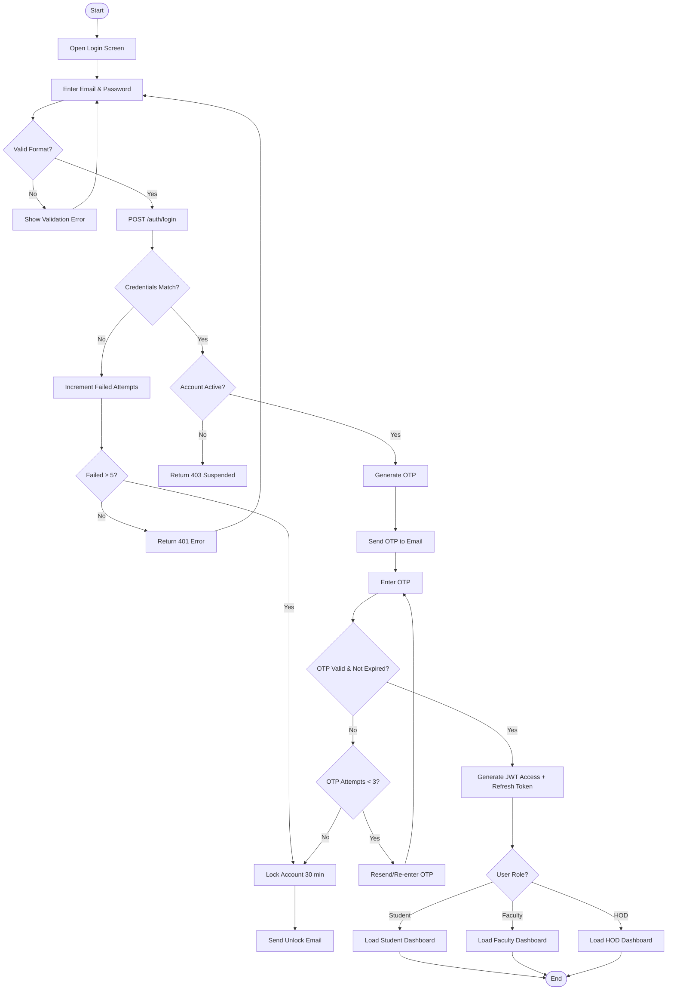
```mermaid
flowchart TD
    A([Start]) --> B[Open Login Screen]
    B --> C[Enter Email & Password]
    C --> D{Valid Format?}
    D -- No --> E[Show Validation Error]
    E --> C
    D -- Yes --> F[POST /auth/login]
    F --> G{Credentials Match?}
    G -- No --> H[Increment Failed Attempts]
    H --> I{Failed ≥ 5?}
    I -- Yes --> J[Lock Account 30 min]
    J --> K[Send Unlock Email]
    I -- No --> L[Return 401 Error]
    L --> C
    G -- Yes --> M{Account Active?}
    M -- No --> N[Return 403 Suspended]
    M -- Yes --> O[Generate OTP]
    O --> P[Send OTP to Email]
    P --> Q[Enter OTP]
    Q --> R{OTP Valid & Not Expired?}
    R -- No --> S{OTP Attempts < 3?}
    S -- Yes --> T[Resend/Re-enter OTP]
    T --> Q
    S -- No --> J
    R -- Yes --> U[Generate JWT Access + Refresh Token]
    U --> V{User Role?}
    V -- Student --> W[Load Student Dashboard]
    V -- Faculty --> X[Load Faculty Dashboard]
    V -- HOD --> Y[Load HOD Dashboard]
    W & X & Y --> Z([End])
```

## FC-02: Attendance Management Flow

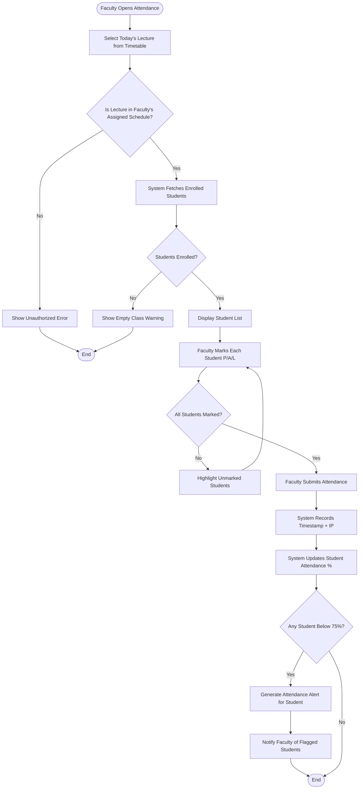
```mermaid
flowchart TD
    A([Faculty Opens Attendance]) --> B[Select Today's Lecture from Timetable]
    B --> C{Is Lecture in Faculty's Assigned Schedule?}
    C -- No --> D[Show Unauthorized Error]
    D --> Z([End])
    C -- Yes --> E[System Fetches Enrolled Students]
    E --> F{Students Enrolled?}
    F -- No --> G[Show Empty Class Warning]
    G --> Z
    F -- Yes --> H[Display Student List]
    H --> I[Faculty Marks Each Student P/A/L]
    I --> J{All Students Marked?}
    J -- No --> K[Highlight Unmarked Students]
    K --> I
    J -- Yes --> L[Faculty Submits Attendance]
    L --> M[System Records Timestamp + IP]
    M --> N[System Updates Student Attendance %]
    N --> O{Any Student Below 75%?}
    O -- Yes --> P[Generate Attendance Alert for Student]
    P --> Q[Notify Faculty of Flagged Students]
    Q --> R([End])
    O -- No --> R
```

## FC-03: Grievance Escalation Flow

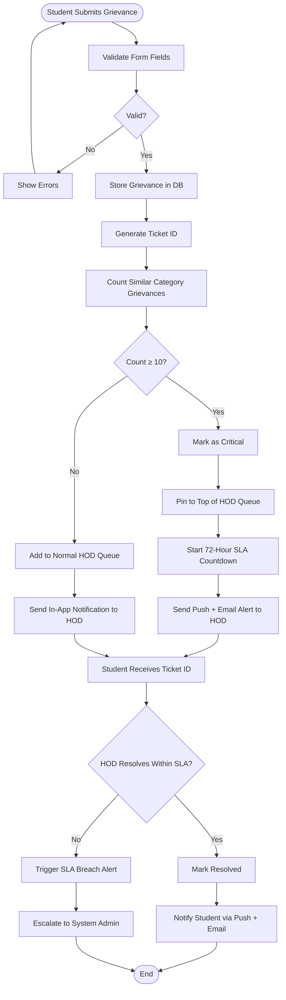
```mermaid
flowchart TD
    A([Student Submits Grievance]) --> B[Validate Form Fields]
    B --> C{Valid?}
    C -- No --> D[Show Errors]
    D --> A
    C -- Yes --> E[Store Grievance in DB]
    E --> F[Generate Ticket ID]
    F --> G[Count Similar Category Grievances]
    G --> H{Count ≥ 10?}
    H -- Yes --> I[Mark as Critical]
    I --> J[Pin to Top of HOD Queue]
    J --> K[Start 72-Hour SLA Countdown]
    K --> L[Send Push + Email Alert to HOD]
    H -- No --> M[Add to Normal HOD Queue]
    M --> N[Send In-App Notification to HOD]
    L & N --> O[Student Receives Ticket ID]
    O --> P{HOD Resolves Within SLA?}
    P -- Yes --> Q[Mark Resolved]
    Q --> R[Notify Student via Push + Email]
    R --> Z([End])
    P -- No --> S[Trigger SLA Breach Alert]
    S --> T[Escalate to System Admin]
    T --> Z
```

## FC-04: Faculty Leave & Substitute Coverage Flow

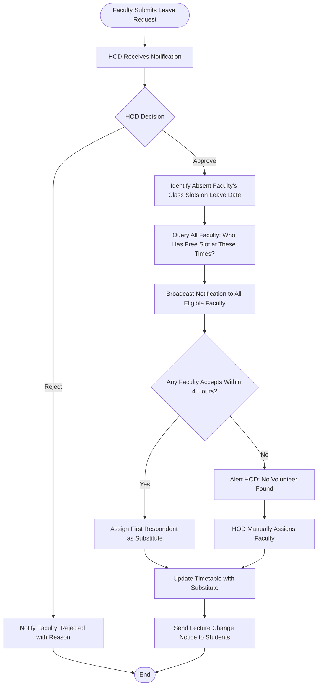
```mermaid
flowchart TD
    A([Faculty Submits Leave Request]) --> B[HOD Receives Notification]
    B --> C{HOD Decision}
    C -- Reject --> D[Notify Faculty: Rejected with Reason]
    D --> Z([End])
    C -- Approve --> E[Identify Absent Faculty's Class Slots on Leave Date]
    E --> F[Query All Faculty: Who Has Free Slot at These Times?]
    F --> G[Broadcast Notification to All Eligible Faculty]
    G --> H{Any Faculty Accepts Within 4 Hours?}
    H -- Yes --> I[Assign First Respondent as Substitute]
    I --> J[Update Timetable with Substitute]
    J --> K[Send Lecture Change Notice to Students]
    K --> Z
    H -- No --> L[Alert HOD: No Volunteer Found]
    L --> M[HOD Manually Assigns Faculty]
    M --> J
```

## FC-05: Mental Health Monitoring Flow

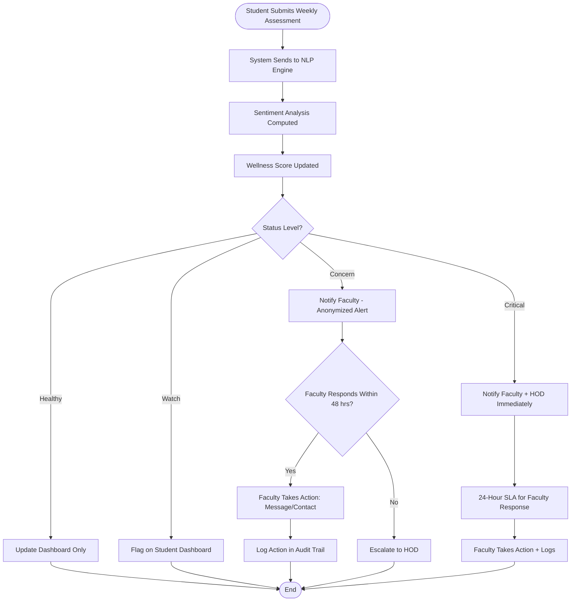
```mermaid
flowchart TD
    A([Student Submits Weekly Assessment]) --> B[System Sends to NLP Engine]
    B --> C[Sentiment Analysis Computed]
    C --> D[Wellness Score Updated]
    D --> E{Status Level?}
    E -- Healthy --> F[Update Dashboard Only]
    F --> Z([End])
    E -- Watch --> G[Flag on Student Dashboard]
    G --> Z
    E -- Concern --> H[Notify Faculty - Anonymized Alert]
    H --> I{Faculty Responds Within 48 hrs?}
    I -- Yes --> J[Faculty Takes Action: Message/Contact]
    J --> K[Log Action in Audit Trail]
    K --> Z
    I -- No --> L[Escalate to HOD]
    L --> Z
    E -- Critical --> M[Notify Faculty + HOD Immediately]
    M --> N[24-Hour SLA for Faculty Response]
    N --> O[Faculty Takes Action + Logs]
    O --> Z
```

---

# 9. Use Case Diagram


```mermaid
graph LR
    Student((Student))
    Faculty((Faculty))
    HOD((HOD))
    System((System))
    Parent((Parent\nPassive))

    Student --> UC1[View Marks & SPI]
    Student --> UC2[View Attendance]
    Student --> UC3[View Timetable]
    Student --> UC4[View Fees]
    Student --> UC5[Raise Grievance]
    Student --> UC6[View Notices]
    Student --> UC7[View Notes & Videos]
    Student --> UC8[View Placement Predictor]
    Student --> UC9[Complete Mental Health Assessment]

    Faculty --> UC10[View Timetable]
    Faculty --> UC11[Fill Attendance]
    Faculty --> UC12[Resolve Student Doubts]
    Faculty --> UC13[Upload Notes & Videos]
    Faculty --> UC14[Apply for Leave]
    Faculty --> UC15[Request Extra/Swap Lecture]
    Faculty --> UC16[Respond to Mental Health Alert]
    Faculty --> UC17[View Student Info for Assigned Subjects]

    HOD --> UC18[View Department Overview]
    HOD --> UC19[Manage Grievances with SLA]
    HOD --> UC20[Approve Leave Requests]
    HOD --> UC21[Send Parent Communications]
    HOD --> UC22[Create & Publish Notices]
    HOD --> UC23[Schedule Remedial Lectures]
    HOD --> UC24[Schedule Seminars]
    HOD --> UC25[Manage Classes & Sections]
    HOD --> UC26[View Fee Defaulters]
    HOD --> UC27[Set Full-Day Leave]

    System --> UC28[Compute Placement Score - Auto]
    System --> UC29[Run Sentiment Analysis - Auto]
    System --> UC30[Send Low-Marks Alert Emails]
    System --> UC31[Broadcast Substitute Notifications]
    System --> UC32[Enforce SLA Timers]
    System --> UC33[Send Fee Reminder Emails]

    UC30 --> Parent
    UC33 --> Parent
```

---

# 10. Detailed Use Cases

## UC-01: Student Views Marks

| Field | Detail |
|---|---|
| **Name** | View Semester Marks |
| **Primary Actor** | Student |
| **Secondary Actor** | System |
| **Trigger** | Student navigates to "Marks" section in dashboard |
| **Preconditions** | Student is authenticated; marks entered by faculty/admin |
| **Postconditions** | Student sees marks; SPI/CPI displayed; grade card downloadable |
| **Main Success Scenario** | 1. Student selects semester → 2. System fetches marks from DB → 3. SPI/CPI computed → 4. Results displayed with subject breakdown |
| **Alternative Flow** | Student selects "All Semesters" → Cumulative CPI view shown |
| **Exception Flow** | Marks not yet entered → "Results not declared" message |
| **Business Rules** | SPI = Σ(Grade Points × Credits) / Σ(Credits); If SPI < 6.0 → parent alert |
| **Validation** | Semester selection must be within student's enrolled semesters |

## UC-02: Faculty Fills Attendance

| Field | Detail |
|---|---|
| **Name** | Mark Attendance for a Lecture |
| **Primary Actor** | Faculty |
| **Secondary Actor** | System |
| **Trigger** | Faculty opens attendance module for current/recent lecture |
| **Preconditions** | Faculty authenticated; lecture must be in faculty's timetable |
| **Postconditions** | Attendance recorded; student percentages updated |
| **Main Success Scenario** | 1. Faculty selects lecture → 2. System loads student list → 3. Faculty marks each student → 4. Submits → 5. System updates attendance % → 6. Shortage alerts generated |
| **Alternative Flow** | Faculty edits attendance within 24-hr window |
| **Exception Flow** | Edit after 24 hrs: HOD approval required |
| **Business Rules** | Proxy prevention: IP + timestamp logged; only assigned faculty can mark for their subject |
| **Validation** | All students must be marked; lecture must be valid in timetable |

## UC-03: Student Raises Grievance

| Field | Detail |
|---|---|
| **Name** | Submit Academic/Administrative Grievance |
| **Primary Actor** | Student |
| **Secondary Actor** | HOD, System |
| **Trigger** | Student clicks "Raise Problem" in portal |
| **Preconditions** | Student authenticated |
| **Postconditions** | Grievance stored; ticket ID issued; HOD notified |
| **Main Success Scenario** | 1. Student selects category → 2. Writes description → 3. Optional attachment → 4. Submit → 5. Ticket ID generated → 6. HOD notified |
| **Alternative Flow** | ≥10 same category → Critical flag; SLA countdown begins |
| **Exception Flow** | Attachment > 10 MB → Validation error |
| **Business Rules** | ≥10 same-category grievances: Critical; 72-hr SLA mandatory |
| **Validation** | Category required; description ≥ 50 characters |

## UC-04: HOD Approves Faculty Leave

| Field | Detail |
|---|---|
| **Name** | Approve/Reject Faculty Leave Request |
| **Primary Actor** | HOD |
| **Secondary Actor** | Faculty, System, All Eligible Substitute Faculty, Students |
| **Trigger** | Faculty submits leave request; HOD receives notification |
| **Preconditions** | HOD authenticated; leave request in pending state |
| **Postconditions** | Leave approved/rejected; if approved, substitute workflow initiated |
| **Main Success Scenario** | 1. HOD reviews request → 2. Approves → 3. System identifies affected slots → 4. Broadcast to eligible faculty → 5. First acceptance → substitute assigned → 6. Students notified |
| **Alternative Flow** | No volunteers → HOD manually assigns |
| **Exception Flow** | HOD rejects → Faculty notified with reason |
| **Business Rules** | Approval window: ideally 4 hrs before lecture; broadcast window: 4 hrs for volunteer response |
| **Validation** | Leave dates must not overlap with already-approved leave |

## UC-05: System Runs Placement Predictor

| Field | Detail |
|---|---|
| **Name** | Automated Placement Readiness Score Computation |
| **Primary Actor** | System |
| **Secondary Actor** | Student (reads result), HOD (sees risk dashboard) |
| **Trigger** | Weekly batch job OR triggered on marks update |
| **Preconditions** | Student has ≥ 1 semester of completed marks |
| **Postconditions** | Placement score stored; student dashboard updated; risk students flagged on HOD panel |
| **Main Success Scenario** | 1. Fetch CPI, attendance, backlogs, extras → 2. Apply weighted formula → 3. Store score → 4. Update eligibility against company criteria → 5. Flag high-risk students to HOD |
| **Alternative Flow** | First-semester student: score shown as "Insufficient data" |
| **Exception Flow** | Missing data → component score defaults to 0 with warning |
| **Business Rules** | Weights: CPI 40%, Attendance 20%, Backlogs 25%, Extra 15% |
| **Validation** | CPI range 0–10; Attendance 0–100%; Backlogs ≥ 0 |

## UC-06: Mental Health Assessment & Alert

| Field | Detail |
|---|---|
| **Name** | Student Mental Health Self-Assessment & Automated Alert |
| **Primary Actor** | Student, NLP Engine |
| **Secondary Actor** | Faculty, HOD |
| **Trigger** | Weekly prompt appears on student dashboard (if opted in) |
| **Preconditions** | Student opted into mental health tracking |
| **Postconditions** | Wellness score updated; alerts sent if threshold breached |
| **Main Success Scenario** | 1. Student completes form → 2. System sends to NLP engine → 3. Score computed → 4. Dashboard updated → 5. If Concern/Critical: faculty/HOD notified |
| **Alternative Flow** | Student skips assessment: no score change; streak broken |
| **Exception Flow** | NLP engine timeout: retry queue; score not updated until resolved |
| **Business Rules** | Raw text NEVER shown to faculty/HOD; encrypted at rest; opt-out cancels all alerts for that student |
| **Validation** | At least 3 questions answered to compute score |

---

# 11. Activity Diagrams

## AD-01: Student Academic Dashboard Activity

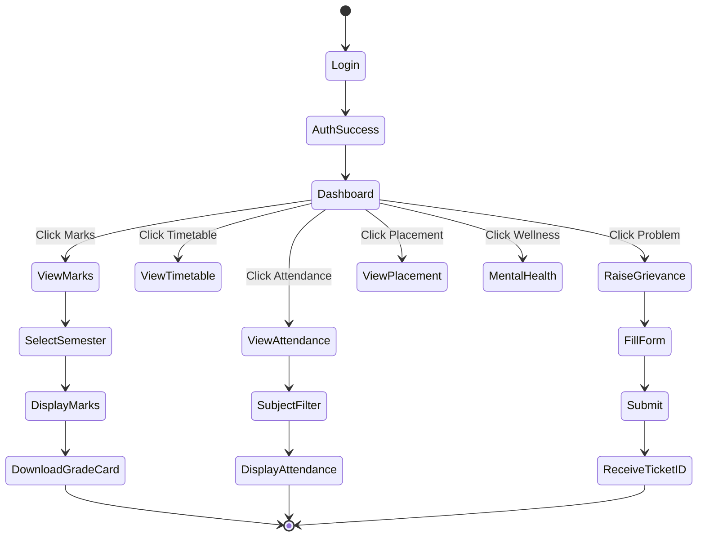
```mermaid
stateDiagram-v2
    [*] --> Login
    Login --> AuthSuccess
    AuthSuccess --> Dashboard
    Dashboard --> ViewMarks: Click Marks
    Dashboard --> ViewAttendance: Click Attendance
    Dashboard --> ViewTimetable: Click Timetable
    Dashboard --> RaiseGrievance: Click Problem
    Dashboard --> ViewPlacement: Click Placement
    Dashboard --> MentalHealth: Click Wellness
    ViewMarks --> SelectSemester
    SelectSemester --> DisplayMarks
    DisplayMarks --> DownloadGradeCard
    DownloadGradeCard --> [*]
    ViewAttendance --> SubjectFilter
    SubjectFilter --> DisplayAttendance
    DisplayAttendance --> [*]
    RaiseGrievance --> FillForm
    FillForm --> Submit
    Submit --> ReceiveTicketID
    ReceiveTicketID --> [*]
```

## AD-02: Faculty Leave Application Activity

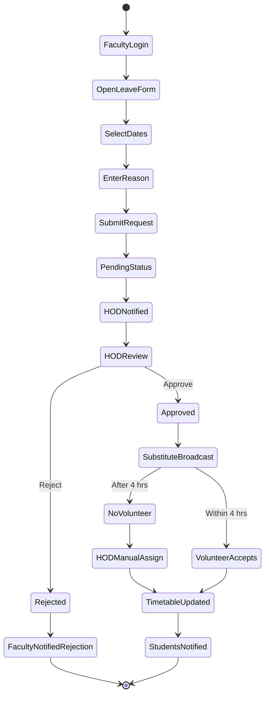
```mermaid
stateDiagram-v2
    [*] --> FacultyLogin
    FacultyLogin --> OpenLeaveForm
    OpenLeaveForm --> SelectDates
    SelectDates --> EnterReason
    EnterReason --> SubmitRequest
    SubmitRequest --> PendingStatus
    PendingStatus --> HODNotified
    HODNotified --> HODReview
    HODReview --> Approved: Approve
    HODReview --> Rejected: Reject
    Rejected --> FacultyNotifiedRejection
    FacultyNotifiedRejection --> [*]
    Approved --> SubstituteBroadcast
    SubstituteBroadcast --> VolunteerAccepts: Within 4 hrs
    SubstituteBroadcast --> NoVolunteer: After 4 hrs
    NoVolunteer --> HODManualAssign
    HODManualAssign --> TimetableUpdated
    VolunteerAccepts --> TimetableUpdated
    TimetableUpdated --> StudentsNotified
    StudentsNotified --> [*]
```

---

# 12. Sequence Diagrams

## SD-01: Login Sequence

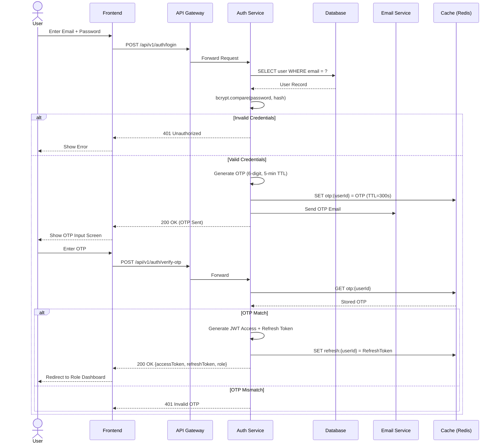
```mermaid
sequenceDiagram
    actor User
    participant FE as Frontend
    participant AG as API Gateway
    participant AS as Auth Service
    participant DB as Database
    participant ES as Email Service
    participant CS as Cache (Redis)

    User->>FE: Enter Email + Password
    FE->>AG: POST /api/v1/auth/login
    AG->>AS: Forward Request
    AS->>DB: SELECT user WHERE email = ?
    DB-->>AS: User Record
    AS->>AS: bcrypt.compare(password, hash)
    alt Invalid Credentials
        AS-->>FE: 401 Unauthorized
        FE-->>User: Show Error
    else Valid Credentials
        AS->>AS: Generate OTP (6-digit, 5-min TTL)
        AS->>CS: SET otp:{userId} = OTP (TTL=300s)
        AS->>ES: Send OTP Email
        AS-->>FE: 200 OK (OTP Sent)
        FE-->>User: Show OTP Input Screen
        User->>FE: Enter OTP
        FE->>AG: POST /api/v1/auth/verify-otp
        AG->>AS: Forward
        AS->>CS: GET otp:{userId}
        CS-->>AS: Stored OTP
        alt OTP Match
            AS->>AS: Generate JWT Access + Refresh Token
            AS->>CS: SET refresh:{userId} = RefreshToken
            AS-->>FE: 200 OK {accessToken, refreshToken, role}
            FE-->>User: Redirect to Role Dashboard
        else OTP Mismatch
            AS-->>FE: 401 Invalid OTP
        end
    end
```

## SD-02: Attendance Submission Sequence

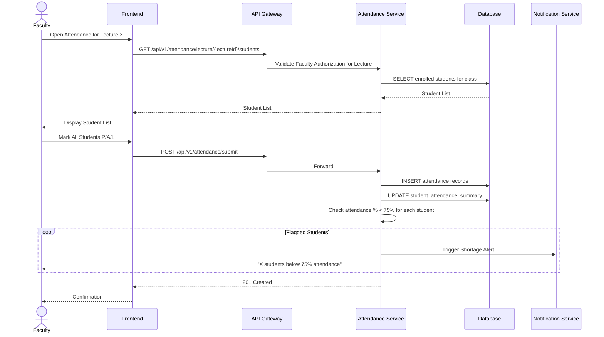
```mermaid
sequenceDiagram
    actor Faculty
    participant FE as Frontend
    participant AG as API Gateway
    participant AS as Attendance Service
    participant DB as Database
    participant NS as Notification Service

    Faculty->>FE: Open Attendance for Lecture X
    FE->>AG: GET /api/v1/attendance/lecture/{lectureId}/students
    AG->>AS: Validate Faculty Authorization for Lecture
    AS->>DB: SELECT enrolled students for class
    DB-->>AS: Student List
    AS-->>FE: Student List
    FE-->>Faculty: Display Student List
    Faculty->>FE: Mark All Students P/A/L
    FE->>AG: POST /api/v1/attendance/submit
    AG->>AS: Forward
    AS->>DB: INSERT attendance records
    AS->>DB: UPDATE student_attendance_summary
    AS->>AS: Check attendance % < 75% for each student
    loop Flagged Students
        AS->>NS: Trigger Shortage Alert
        NS-->>Faculty: "X students below 75% attendance"
    end
    AS-->>FE: 201 Created
    FE-->>Faculty: Confirmation
```

## SD-03: Grievance Submission & Escalation Sequence

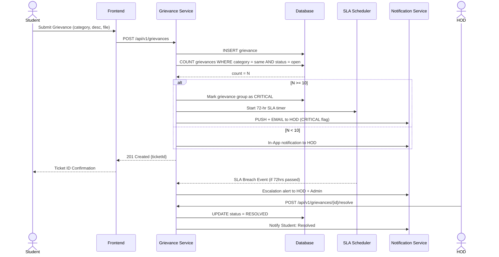
```mermaid
sequenceDiagram
    actor Student
    participant FE as Frontend
    participant GS as Grievance Service
    participant DB as Database
    participant SS as SLA Scheduler
    participant NS as Notification Service
    actor HOD

    Student->>FE: Submit Grievance (category, desc, file)
    FE->>GS: POST /api/v1/grievances
    GS->>DB: INSERT grievance
    GS->>DB: COUNT grievances WHERE category = same AND status = open
    DB-->>GS: count = N
    alt N >= 10
        GS->>DB: Mark grievance group as CRITICAL
        GS->>SS: Start 72-hr SLA timer
        GS->>NS: PUSH + EMAIL to HOD (CRITICAL flag)
    else N < 10
        GS->>NS: In-App notification to HOD
    end
    GS-->>FE: 201 Created {ticketId}
    FE-->>Student: Ticket ID Confirmation
    SS-->>GS: SLA Breach Event (if 72hrs passed)
    GS->>NS: Escalation alert to HOD + Admin
    HOD->>GS: POST /api/v1/grievances/{id}/resolve
    GS->>DB: UPDATE status = RESOLVED
    GS->>NS: Notify Student: Resolved
```

## SD-04: Leave Approval & Substitute Workflow Sequence

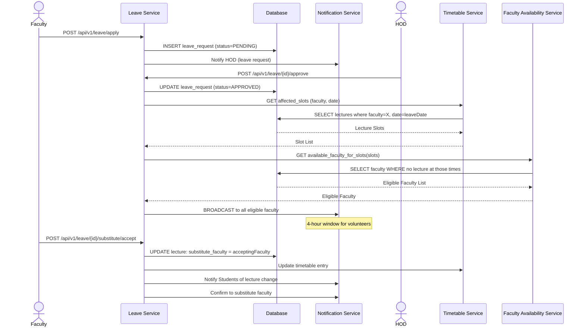
```mermaid
sequenceDiagram
    actor Faculty
    participant LS as Leave Service
    participant DB as Database
    participant NS as Notification Service
    actor HOD
    participant TS as Timetable Service
    participant FS as Faculty Availability Service

    Faculty->>LS: POST /api/v1/leave/apply
    LS->>DB: INSERT leave_request (status=PENDING)
    LS->>NS: Notify HOD (leave request)
    HOD->>LS: POST /api/v1/leave/{id}/approve
    LS->>DB: UPDATE leave_request (status=APPROVED)
    LS->>TS: GET affected_slots (faculty, date)
    TS->>DB: SELECT lectures where faculty=X, date=leaveDate
    DB-->>TS: Lecture Slots
    TS-->>LS: Slot List
    LS->>FS: GET available_faculty_for_slots(slots)
    FS->>DB: SELECT faculty WHERE no lecture at those times
    DB-->>FS: Eligible Faculty List
    FS-->>LS: Eligible Faculty
    LS->>NS: BROADCAST to all eligible faculty
    Note over NS: 4-hour window for volunteers
    Faculty->>LS: POST /api/v1/leave/{id}/substitute/accept
    LS->>DB: UPDATE lecture: substitute_faculty = acceptingFaculty
    LS->>TS: Update timetable entry
    LS->>NS: Notify Students of lecture change
    LS->>NS: Confirm to substitute faculty
```

---

# 13. State Machine Diagrams

## SM-01: Grievance States

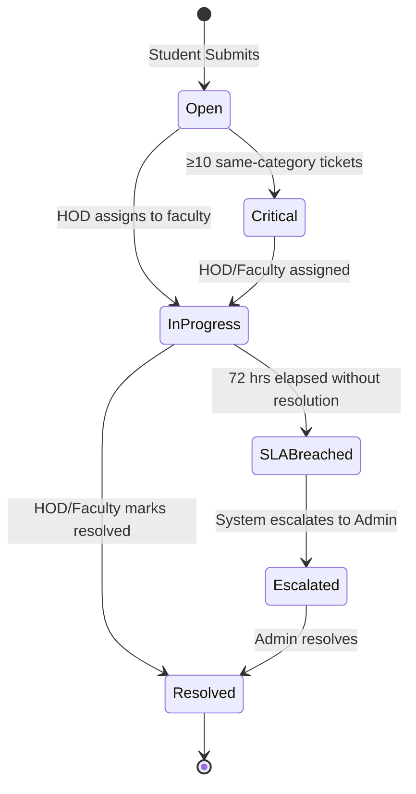
```mermaid
stateDiagram-v2
    [*] --> Open: Student Submits
    Open --> Critical: ≥10 same-category tickets
    Open --> InProgress: HOD assigns to faculty
    Critical --> InProgress: HOD/Faculty assigned
    InProgress --> Resolved: HOD/Faculty marks resolved
    InProgress --> SLABreached: 72 hrs elapsed without resolution
    SLABreached --> Escalated: System escalates to Admin
    Escalated --> Resolved: Admin resolves
    Resolved --> [*]
```

## SM-02: Leave Request States

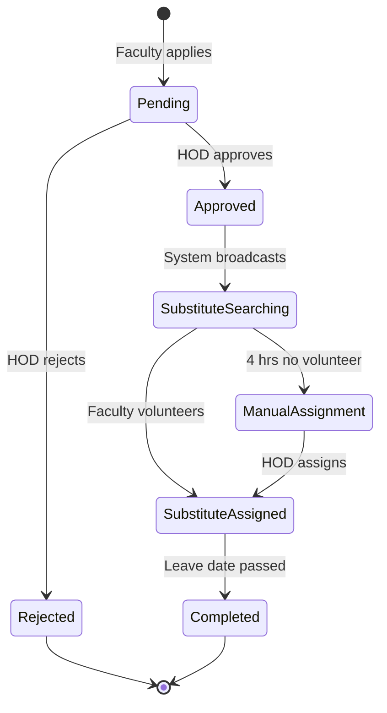
```mermaid
stateDiagram-v2
    [*] --> Pending: Faculty applies
    Pending --> Approved: HOD approves
    Pending --> Rejected: HOD rejects
    Rejected --> [*]
    Approved --> SubstituteSearching: System broadcasts
    SubstituteSearching --> SubstituteAssigned: Faculty volunteers
    SubstituteSearching --> ManualAssignment: 4 hrs no volunteer
    ManualAssignment --> SubstituteAssigned: HOD assigns
    SubstituteAssigned --> Completed: Leave date passed
    Completed --> [*]
```

## SM-03: Mental Health Status States

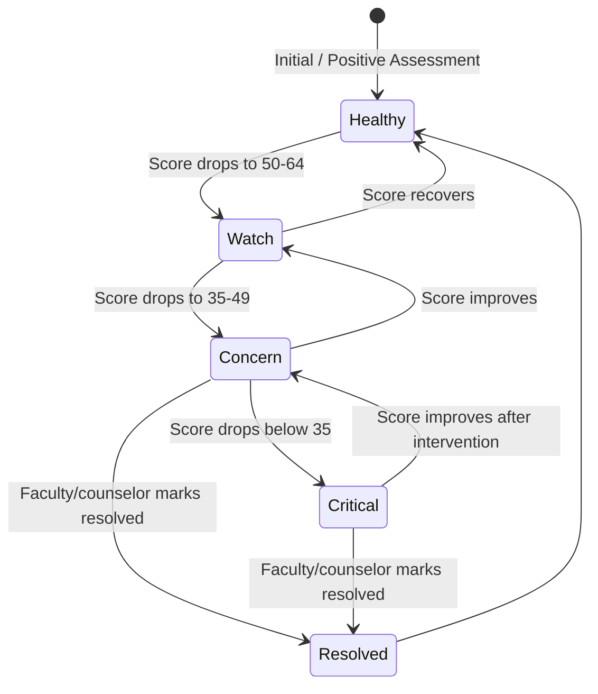
```mermaid
stateDiagram-v2
    [*] --> Healthy: Initial / Positive Assessment
    Healthy --> Watch: Score drops to 50-64
    Watch --> Concern: Score drops to 35-49
    Watch --> Healthy: Score recovers
    Concern --> Critical: Score drops below 35
    Concern --> Watch: Score improves
    Critical --> Concern: Score improves after intervention
    Concern --> Resolved: Faculty/counselor marks resolved
    Critical --> Resolved: Faculty/counselor marks resolved
    Resolved --> Healthy
```

## SM-04: Doubt Resolution States

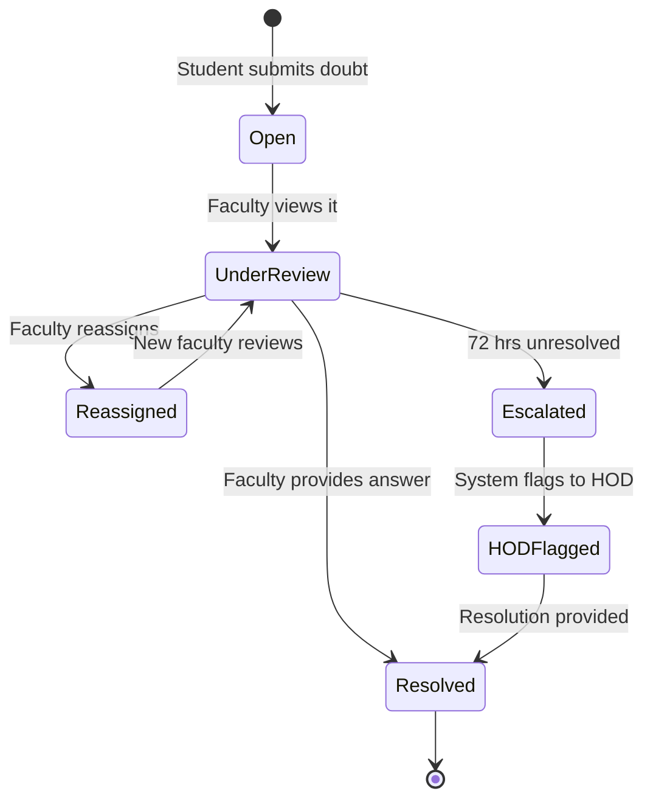
```mermaid
stateDiagram-v2
    [*] --> Open: Student submits doubt
    Open --> UnderReview: Faculty views it
    UnderReview --> Resolved: Faculty provides answer
    UnderReview --> Reassigned: Faculty reassigns
    Reassigned --> UnderReview: New faculty reviews
    UnderReview --> Escalated: 72 hrs unresolved
    Escalated --> HODFlagged: System flags to HOD
    HODFlagged --> Resolved: Resolution provided
    Resolved --> [*]
```

---

# 14. Class Diagram


```mermaid
classDiagram
    class User {
        +UUID id
        +String email
        +String passwordHash
        +Enum role
        +Boolean isActive
        +DateTime createdAt
        +DateTime lastLogin
        +login(email, password) JWT
        +logout() void
        +resetPassword(token, newPassword) void
    }

    class Student {
        +UUID studentId
        +String enrollmentNo
        +String firstName
        +String lastName
        +Date dateOfBirth
        +String parentEmail
        +String parentPhone
        +UUID departmentId
        +UUID currentSemesterId
        +getMarks(semesterId) List~Mark~
        +getAttendance(subjectId) AttendanceSummary
        +getPlacementScore() PlacementScore
        +submitGrievance(category, desc) Grievance
        +getWellnessScore() WellnessRecord
    }

    class Faculty {
        +UUID facultyId
        +String employeeId
        +String firstName
        +String lastName
        +UUID departmentId
        +List~UUID~ assignedSubjectIds
        +fillAttendance(lectureId, records) void
        +uploadContent(subjectId, file) Content
        +resolveDoubt(doubtId, resolution) void
        +applyLeave(dates, reason) LeaveRequest
        +requestExtraLecture(details) LectureRequest
    }

    class HOD {
        +UUID hodId
        +UUID departmentId
        +getDepartmentOverview() DeptSummary
        +approveLeave(leaveId) void
        +resolveGrievance(grievanceId, note) void
        +publishNotice(notice) Notice
        +scheduleRemedialLecture(details) Lecture
        +scheduleSeminar(details) Seminar
        +manageClass(classId) Section
        +setFullDayLeave(date, reason) void
    }

    class Department {
        +UUID departmentId
        +String name
        +String code
        +UUID hodId
        +List~UUID~ studentIds
        +List~UUID~ facultyIds
    }

    class Subject {
        +UUID subjectId
        +String code
        +String name
        +Integer credits
        +Enum type
        +UUID departmentId
        +UUID semesterId
        +UUID facultyId
    }

    class Semester {
        +UUID semesterId
        +Integer number
        +String academicYear
        +Date startDate
        +Date endDate
        +Boolean isActive
    }

    class Mark {
        +UUID markId
        +UUID studentId
        +UUID subjectId
        +UUID semesterId
        +Float internalMarks
        +Float externalMarks
        +Float totalMarks
        +String grade
        +Float gradePoints
        +computeSPI() Float
    }

    class AttendanceRecord {
        +UUID recordId
        +UUID studentId
        +UUID subjectId
        +UUID lectureId
        +Date date
        +Enum status
        +UUID markedByFacultyId
        +String ipAddress
        +DateTime timestamp
    }

    class AttendanceSummary {
        +UUID summaryId
        +UUID studentId
        +UUID subjectId
        +Integer totalLectures
        +Integer presentCount
        +Float percentage
        +Boolean isShortage
    }

    class Grievance {
        +UUID grievanceId
        +UUID studentId
        +String category
        +String description
        +String attachmentUrl
        +Enum status
        +Boolean isCritical
        +DateTime submittedAt
        +DateTime resolvedAt
        +String resolutionNote
        +Integer slaHoursRemaining
    }

    class Notice {
        +UUID noticeId
        +String title
        +String content
        +UUID authorId
        +Enum authorRole
        +Enum target
        +Enum priority
        +DateTime publishedAt
        +Boolean isActive
    }

    class Content {
        +UUID contentId
        +UUID subjectId
        +UUID facultyId
        +Enum type
        +String title
        +String fileUrl
        +String videoUrl
        +String topicTag
        +DateTime uploadedAt
        +Boolean isActive
    }

    class Timetable {
        +UUID timetableId
        +UUID classId
        +UUID subjectId
        +UUID facultyId
        +Enum dayOfWeek
        +Time startTime
        +Time endTime
        +String roomNo
        +UUID academicYearId
    }

    class LectureChange {
        +UUID changeId
        +UUID originalTimetableId
        +Date changeDate
        +Enum changeType
        +UUID substituteFacultyId
        +Boolean isCancelled
        +String reason
        +DateTime createdAt
    }

    class LeaveRequest {
        +UUID leaveId
        +UUID facultyId
        +Date fromDate
        +Date toDate
        +Enum leaveType
        +String reason
        +Enum status
        +UUID approvedByHodId
        +DateTime appliedAt
        +DateTime decisionAt
    }

    class PlacementScore {
        +UUID scoreId
        +UUID studentId
        +Float cpiScore
        +Float attendanceScore
        +Float backlogScore
        +Float extraScore
        +Float totalScore
        +Enum category
        +DateTime computedAt
        +List~String~ eligibleCompanies
    }

    class WellnessRecord {
        +UUID recordId
        +UUID studentId
        +String encryptedResponses
        +Float sentimentScore
        +Enum status
        +DateTime assessmentDate
        +Boolean isFlagged
    }

    class Doubt {
        +UUID doubtId
        +UUID studentId
        +UUID subjectId
        +String question
        +String attachmentUrl
        +Enum status
        +UUID assignedFacultyId
        +String resolution
        +DateTime submittedAt
        +DateTime resolvedAt
    }

    class FeeStructure {
        +UUID feeId
        +UUID semesterId
        +UUID programId
        +String componentName
        +Float amount
        +Date dueDate
        +Boolean isOptional
    }

    class FeePayment {
        +UUID paymentId
        +UUID studentId
        +UUID feeStructureId
        +Float amountPaid
        +Date paymentDate
        +Enum status
        +String transactionRef
    }

    class Notification {
        +UUID notificationId
        +UUID recipientId
        +Enum recipientRole
        +String title
        +String body
        +Enum channel
        +Boolean isRead
        +DateTime sentAt
        +Boolean deliverySuccess
    }

    User <|-- Student : extends
    User <|-- Faculty : extends
    User <|-- HOD : extends
    Department "1" --> "*" Student : contains
    Department "1" --> "*" Faculty : contains
    Department "1" --> "1" HOD : managed by
    Subject "*" --> "1" Semester : belongs to
    Subject "*" --> "1" Faculty : taught by
    Student "*" --> "*" Subject : enrolls in
    Mark "*" --> "1" Student : belongs to
    Mark "*" --> "1" Subject : for
    AttendanceRecord "*" --> "1" Student : for
    AttendanceRecord "*" --> "1" Subject : in
    AttendanceSummary "*" --> "1" Student : summarizes
    AttendanceSummary "*" --> "1" Subject : for
    Grievance "*" --> "1" Student : raised by
    Notice "*" --> "1" User : created by
    Content "*" --> "1" Subject : for
    Content "*" --> "1" Faculty : uploaded by
    Timetable "*" --> "1" Subject : schedules
    Timetable "*" --> "1" Faculty : assigns
    LectureChange "*" --> "1" Timetable : modifies
    LeaveRequest "*" --> "1" Faculty : applied by
    PlacementScore "1" --> "1" Student : computed for
    WellnessRecord "*" --> "1" Student : belongs to
    Doubt "*" --> "1" Student : asked by
    Doubt "*" --> "1" Subject : about
    FeePayment "*" --> "1" Student : paid by
    FeePayment "*" --> "1" FeeStructure : for
    Notification "*" --> "1" User : sent to
```

---

# 15. Object Relationships

| Relationship | Type | Description |
|---|---|---|
| User → Student/Faculty/HOD | Inheritance (IS-A) | Single-table or joined-table inheritance for user subtypes |
| Department → Student | One-to-Many | A department has many students |
| Department → Faculty | One-to-Many | A department has many faculty members |
| Department → HOD | One-to-One | Each department has exactly one HOD |
| Subject → Semester | Many-to-One | Each subject belongs to one semester |
| Subject → Faculty | Many-to-One | Each subject is taught by one faculty (v1; may be many in future) |
| Student → Subject | Many-to-Many | Via Enrollment junction table |
| Mark → Student | Many-to-One | A student has many marks (one per subject per semester) |
| AttendanceRecord → Student | Many-to-One | A student has many attendance records |
| AttendanceSummary → Student | Many-to-One | One summary per student per subject |
| Grievance → Student | Many-to-One | A student can raise multiple grievances |
| Content → Subject | Many-to-One | Multiple content items per subject |
| Timetable → Faculty | Many-to-One | One faculty can have many timetable slots |
| LectureChange → Timetable | Many-to-One | Changes reference a base timetable slot |
| LeaveRequest → Faculty | Many-to-One | Faculty can have multiple leave requests |
| PlacementScore → Student | One-to-One (per computation) | Latest score is the active one |
| WellnessRecord → Student | Many-to-One | A student submits many assessments over time |
| FeePayment → FeeStructure | Many-to-One | Multiple students pay against same fee structure |
| Notification → User | Many-to-One | A user receives many notifications |

---

# 16. Entity Relationship Diagram (ERD)

```mermaid
erDiagram
    USERS {
        UUID id PK
        VARCHAR email UK
        VARCHAR password_hash
        ENUM role
        BOOLEAN is_active
        TIMESTAMP created_at
        TIMESTAMP last_login
    }

    STUDENTS {
        UUID student_id PK
        UUID user_id FK
        VARCHAR enrollment_no UK
        VARCHAR first_name
        VARCHAR last_name
        DATE date_of_birth
        VARCHAR parent_email
        VARCHAR parent_phone
        UUID department_id FK
        UUID current_semester_id FK
    }

    FACULTY {
        UUID faculty_id PK
        UUID user_id FK
        VARCHAR employee_id UK
        VARCHAR first_name
        VARCHAR last_name
        UUID department_id FK
    }

    HOD {
        UUID hod_id PK
        UUID user_id FK
        UUID department_id FK UK
    }

    DEPARTMENTS {
        UUID department_id PK
        VARCHAR name
        VARCHAR code UK
        UUID hod_id FK
    }

    SEMESTERS {
        UUID semester_id PK
        INTEGER number
        VARCHAR academic_year
        DATE start_date
        DATE end_date
        BOOLEAN is_active
    }

    SUBJECTS {
        UUID subject_id PK
        VARCHAR code UK
        VARCHAR name
        INTEGER credits
        ENUM subject_type
        UUID department_id FK
        UUID semester_id FK
        UUID faculty_id FK
    }

    ENROLLMENTS {
        UUID enrollment_id PK
        UUID student_id FK
        UUID subject_id FK
        UUID semester_id FK
        DATE enrolled_date
    }

    MARKS {
        UUID mark_id PK
        UUID student_id FK
        UUID subject_id FK
        UUID semester_id FK
        DECIMAL internal_marks
        DECIMAL external_marks
        DECIMAL total_marks
        VARCHAR grade
        DECIMAL grade_points
        TIMESTAMP entered_at
        UUID entered_by FK
    }

    ATTENDANCE_RECORDS {
        UUID record_id PK
        UUID student_id FK
        UUID subject_id FK
        UUID lecture_id FK
        DATE date
        ENUM status
        UUID marked_by FK
        VARCHAR ip_address
        TIMESTAMP marked_at
    }

    ATTENDANCE_SUMMARY {
        UUID summary_id PK
        UUID student_id FK
        UUID subject_id FK
        INTEGER total_lectures
        INTEGER present_count
        DECIMAL percentage
        BOOLEAN is_shortage
        TIMESTAMP updated_at
    }

    TIMETABLE {
        UUID timetable_id PK
        UUID class_section_id FK
        UUID subject_id FK
        UUID faculty_id FK
        ENUM day_of_week
        TIME start_time
        TIME end_time
        VARCHAR room_no
        VARCHAR academic_year
        BOOLEAN is_active
    }

    LECTURE_CHANGES {
        UUID change_id PK
        UUID timetable_id FK
        DATE change_date
        ENUM change_type
        UUID substitute_faculty_id FK
        BOOLEAN is_cancelled
        VARCHAR reason
        UUID approved_by FK
        TIMESTAMP created_at
    }

    LEAVE_REQUESTS {
        UUID leave_id PK
        UUID faculty_id FK
        DATE from_date
        DATE to_date
        ENUM leave_type
        VARCHAR reason
        ENUM status
        UUID approved_by_hod FK
        TIMESTAMP applied_at
        TIMESTAMP decision_at
    }

    GRIEVANCES {
        UUID grievance_id PK
        UUID student_id FK
        VARCHAR category
        TEXT description
        VARCHAR attachment_url
        ENUM status
        BOOLEAN is_critical
        TEXT resolution_note
        UUID resolved_by FK
        TIMESTAMP submitted_at
        TIMESTAMP resolved_at
    }

    NOTICES {
        UUID notice_id PK
        UUID author_id FK
        ENUM author_role
        VARCHAR title
        TEXT content
        ENUM target_audience
        ENUM priority
        TIMESTAMP published_at
        BOOLEAN is_active
    }

    CONTENT {
        UUID content_id PK
        UUID subject_id FK
        UUID faculty_id FK
        ENUM content_type
        VARCHAR title
        VARCHAR file_url
        VARCHAR video_url
        VARCHAR topic_tag
        TIMESTAMP uploaded_at
        BOOLEAN is_active
    }

    PLACEMENT_SCORES {
        UUID score_id PK
        UUID student_id FK
        DECIMAL cpi_score
        DECIMAL attendance_score
        DECIMAL backlog_score
        DECIMAL extra_score
        DECIMAL total_score
        ENUM category
        TIMESTAMP computed_at
    }

    PLACEMENT_COMPANIES {
        UUID company_id PK
        VARCHAR name
        DECIMAL min_cpi
        INTEGER max_backlogs
        DECIMAL min_attendance
        TEXT other_criteria
        BOOLEAN is_active
    }

    WELLNESS_RECORDS {
        UUID record_id PK
        UUID student_id FK
        TEXT encrypted_responses
        DECIMAL sentiment_score
        ENUM status
        DATE assessment_date
        BOOLEAN is_flagged
    }

    DOUBTS {
        UUID doubt_id PK
        UUID student_id FK
        UUID subject_id FK
        TEXT question
        VARCHAR attachment_url
        ENUM status
        UUID assigned_faculty_id FK
        TEXT resolution
        TIMESTAMP submitted_at
        TIMESTAMP resolved_at
    }

    FEE_STRUCTURES {
        UUID fee_id PK
        UUID semester_id FK
        VARCHAR program_code
        VARCHAR component_name
        DECIMAL amount
        DATE due_date
        BOOLEAN is_optional
    }

    FEE_PAYMENTS {
        UUID payment_id PK
        UUID student_id FK
        UUID fee_structure_id FK
        DECIMAL amount_paid
        DATE payment_date
        ENUM status
        VARCHAR transaction_ref
    }

    NOTIFICATIONS {
        UUID notification_id PK
        UUID recipient_id FK
        ENUM recipient_role
        VARCHAR title
        TEXT body
        ENUM channel
        BOOLEAN is_read
        BOOLEAN delivery_success
        TIMESTAMP sent_at
    }

    CLASS_SECTIONS {
        UUID section_id PK
        UUID department_id FK
        UUID semester_id FK
        VARCHAR section_name
        INTEGER capacity
        UUID created_by_hod FK
    }

    AUDIT_LOGS {
        UUID log_id PK
        UUID actor_id FK
        VARCHAR action
        VARCHAR entity_type
        UUID entity_id
        JSONB old_value
        JSONB new_value
        VARCHAR ip_address
        TIMESTAMP created_at
    }

    USERS ||--o| STUDENTS : "is"
    USERS ||--o| FACULTY : "is"
    USERS ||--o| HOD : "is"
    DEPARTMENTS ||--|| HOD : "managed by"
    DEPARTMENTS ||--o{ STUDENTS : "contains"
    DEPARTMENTS ||--o{ FACULTY : "employs"
    STUDENTS ||--o{ ENROLLMENTS : "has"
    SUBJECTS ||--o{ ENROLLMENTS : "has"
    SUBJECTS }o--|| SEMESTERS : "in"
    SUBJECTS }o--|| FACULTY : "taught by"
    SUBJECTS }o--|| DEPARTMENTS : "belongs to"
    STUDENTS ||--o{ MARKS : "receives"
    SUBJECTS ||--o{ MARKS : "generates"
    STUDENTS ||--o{ ATTENDANCE_RECORDS : "has"
    SUBJECTS ||--o{ ATTENDANCE_RECORDS : "in"
    STUDENTS ||--o{ ATTENDANCE_SUMMARY : "has"
    SUBJECTS ||--o{ ATTENDANCE_SUMMARY : "for"
    CLASS_SECTIONS ||--o{ TIMETABLE : "scheduled in"
    SUBJECTS ||--o{ TIMETABLE : "scheduled as"
    FACULTY ||--o{ TIMETABLE : "teaches in"
    TIMETABLE ||--o{ LECTURE_CHANGES : "changed by"
    FACULTY ||--o{ LEAVE_REQUESTS : "submits"
    STUDENTS ||--o{ GRIEVANCES : "raises"
    USERS ||--o{ NOTICES : "creates"
    SUBJECTS ||--o{ CONTENT : "has"
    FACULTY ||--o{ CONTENT : "uploads"
    STUDENTS ||--o{ PLACEMENT_SCORES : "has"
    STUDENTS ||--o{ WELLNESS_RECORDS : "has"
    STUDENTS ||--o{ DOUBTS : "asks"
    SUBJECTS ||--o{ DOUBTS : "about"
    STUDENTS ||--o{ FEE_PAYMENTS : "makes"
    FEE_STRUCTURES ||--o{ FEE_PAYMENTS : "paid via"
    SEMESTERS ||--o{ FEE_STRUCTURES : "has"
    USERS ||--o{ NOTIFICATIONS : "receives"
    USERS ||--o{ AUDIT_LOGS : "generates"
    DEPARTMENTS ||--o{ CLASS_SECTIONS : "organizes"
```

---

# 17. Complete Database Design

### Table: USERS

| Column | Type | Constraints | Description |
|---|---|---|---|
| id | UUID | PK, NOT NULL | Primary identifier |
| email | VARCHAR(255) | UNIQUE, NOT NULL | Login credential |
| password_hash | VARCHAR(60) | NOT NULL | bcrypt hash |
| role | ENUM('STUDENT','FACULTY','HOD','ADMIN') | NOT NULL | Access role |
| is_active | BOOLEAN | DEFAULT TRUE | Account status |
| created_at | TIMESTAMP | DEFAULT NOW() | Account creation |
| last_login | TIMESTAMP | NULLABLE | Last successful login |
| **Indexes:** | email (UNIQUE), role | | |

### Table: STUDENTS

| Column | Type | Constraints | Description |
|---|---|---|---|
| student_id | UUID | PK | Surrogate key |
| user_id | UUID | FK → USERS.id, UNIQUE | Auth identity |
| enrollment_no | VARCHAR(20) | UNIQUE, NOT NULL | Institute-issued |
| first_name | VARCHAR(100) | NOT NULL | |
| last_name | VARCHAR(100) | NOT NULL | |
| date_of_birth | DATE | NOT NULL | |
| parent_email | VARCHAR(255) | NOT NULL | For alerts |
| parent_phone | VARCHAR(15) | NULLABLE | For calls |
| department_id | UUID | FK → DEPARTMENTS.department_id | |
| current_semester_id | UUID | FK → SEMESTERS.semester_id | |
| **Indexes:** | department_id, current_semester_id, enrollment_no | | |

### Table: FACULTY

| Column | Type | Constraints | Description |
|---|---|---|---|
| faculty_id | UUID | PK | |
| user_id | UUID | FK → USERS.id, UNIQUE | |
| employee_id | VARCHAR(20) | UNIQUE, NOT NULL | |
| first_name | VARCHAR(100) | NOT NULL | |
| last_name | VARCHAR(100) | NOT NULL | |
| department_id | UUID | FK → DEPARTMENTS.department_id | |
| **Indexes:** | department_id, employee_id | | |

### Table: MARKS

| Column | Type | Constraints | Description |
|---|---|---|---|
| mark_id | UUID | PK | |
| student_id | UUID | FK → STUDENTS | NOT NULL |
| subject_id | UUID | FK → SUBJECTS | NOT NULL |
| semester_id | UUID | FK → SEMESTERS | NOT NULL |
| internal_marks | DECIMAL(5,2) | CHECK (0–50) | |
| external_marks | DECIMAL(5,2) | CHECK (0–70) | |
| total_marks | DECIMAL(5,2) | COMPUTED | internal + external |
| grade | VARCHAR(5) | NOT NULL | A+, A, B, etc. |
| grade_points | DECIMAL(3,1) | NOT NULL | 10, 9, 8, etc. |
| entered_at | TIMESTAMP | DEFAULT NOW() | |
| entered_by | UUID | FK → USERS.id | Faculty/Admin |
| **Unique Constraint:** | (student_id, subject_id, semester_id) | | One mark record per student per subject per semester |
| **Indexes:** | student_id + semester_id, subject_id | | |

### Table: ATTENDANCE_RECORDS

| Column | Type | Constraints | Description |
|---|---|---|---|
| record_id | UUID | PK | |
| student_id | UUID | FK → STUDENTS | |
| subject_id | UUID | FK → SUBJECTS | |
| lecture_id | UUID | FK → TIMETABLE | |
| date | DATE | NOT NULL | |
| status | ENUM('P','A','L') | NOT NULL | Present/Absent/Late |
| marked_by | UUID | FK → FACULTY.faculty_id | |
| ip_address | VARCHAR(45) | NOT NULL | Audit |
| marked_at | TIMESTAMP | DEFAULT NOW() | |
| **Unique Constraint:** | (student_id, lecture_id, date) | | |
| **Indexes:** | student_id + subject_id, date, lecture_id | | |
| **Partitioning:** | By date (monthly range partition) | | High-volume table |

### Table: GRIEVANCES

| Column | Type | Constraints | Description |
|---|---|---|---|
| grievance_id | UUID | PK | |
| student_id | UUID | FK → STUDENTS | |
| category | VARCHAR(100) | NOT NULL | |
| description | TEXT | NOT NULL, MIN 50 chars | |
| attachment_url | VARCHAR(500) | NULLABLE | |
| status | ENUM('OPEN','IN_PROGRESS','RESOLVED','SLA_BREACHED','ESCALATED') | DEFAULT 'OPEN' | |
| is_critical | BOOLEAN | DEFAULT FALSE | ≥10 same category |
| resolution_note | TEXT | NULLABLE | |
| resolved_by | UUID | FK → USERS.id NULLABLE | |
| submitted_at | TIMESTAMP | DEFAULT NOW() | |
| resolved_at | TIMESTAMP | NULLABLE | |
| sla_deadline | TIMESTAMP | NULLABLE | Set when is_critical=TRUE |
| **Indexes:** | student_id, status, category, is_critical | | |

### Table: TIMETABLE

| Column | Type | Constraints | Description |
|---|---|---|---|
| timetable_id | UUID | PK | |
| class_section_id | UUID | FK → CLASS_SECTIONS | |
| subject_id | UUID | FK → SUBJECTS | |
| faculty_id | UUID | FK → FACULTY | |
| day_of_week | ENUM('MON','TUE','WED','THU','FRI','SAT') | NOT NULL | |
| start_time | TIME | NOT NULL | |
| end_time | TIME | NOT NULL | |
| room_no | VARCHAR(20) | NULLABLE | |
| academic_year | VARCHAR(10) | NOT NULL | e.g. "2025-26" |
| is_active | BOOLEAN | DEFAULT TRUE | |
| **Unique Constraint:** | (faculty_id, day_of_week, start_time, academic_year) | | No double-booking |
| **Indexes:** | class_section_id + day_of_week, faculty_id | | |

### Table: WELLNESS_RECORDS

| Column | Type | Constraints | Description |
|---|---|---|---|
| record_id | UUID | PK | |
| student_id | UUID | FK → STUDENTS | |
| encrypted_responses | TEXT | NOT NULL | AES-256 encrypted |
| sentiment_score | DECIMAL(5,2) | CHECK (0–100) | |
| status | ENUM('HEALTHY','WATCH','CONCERN','CRITICAL') | NOT NULL | |
| assessment_date | DATE | NOT NULL | |
| is_flagged | BOOLEAN | DEFAULT FALSE | |
| **Unique Constraint:** | (student_id, assessment_date) | | One per day |
| **Indexes:** | student_id, status, assessment_date | | |
| **Note:** | Raw encrypted_responses never decrypted outside wellness service; encryption key in KMS | | |

### Table: AUDIT_LOGS

| Column | Type | Constraints | Description |
|---|---|---|---|
| log_id | UUID | PK | |
| actor_id | UUID | FK → USERS.id | Who did it |
| action | VARCHAR(100) | NOT NULL | e.g. MARK_ATTENDANCE |
| entity_type | VARCHAR(50) | NOT NULL | e.g. Grievance |
| entity_id | UUID | NOT NULL | Target record |
| old_value | JSONB | NULLABLE | Before state |
| new_value | JSONB | NULLABLE | After state |
| ip_address | VARCHAR(45) | NOT NULL | |
| created_at | TIMESTAMP | DEFAULT NOW() | |
| **Indexes:** | actor_id, entity_type + entity_id, created_at | | |
| **Retention:** | 3 years; immutable (no UPDATE/DELETE allowed) | | |
| **Partitioning:** | By month | | |

---

# 18. Database Optimization

## Indexing Strategy

| Table | Index Type | Columns | Reason |
|---|---|---|---|
| ATTENDANCE_RECORDS | Composite B-tree | (student_id, subject_id, date) | Frequent join for attendance % |
| ATTENDANCE_RECORDS | B-tree | date | Date-range queries |
| MARKS | Composite B-tree | (student_id, semester_id) | SPI computation |
| GRIEVANCES | B-tree | (category, status, is_critical) | HOD priority queue |
| NOTIFICATIONS | Composite B-tree | (recipient_id, is_read) | Unread count queries |
| TIMETABLE | Composite B-tree | (faculty_id, day_of_week, academic_year) | Conflict detection |
| WELLNESS_RECORDS | B-tree | (student_id, assessment_date) | Trend queries |
| AUDIT_LOGS | B-tree | (actor_id, created_at) | Audit queries |
| STUDENTS | B-tree | (department_id, current_semester_id) | HOD dashboard filtering |

## Partitioning

| Table | Strategy | Partition Key | Rationale |
|---|---|---|---|
| ATTENDANCE_RECORDS | Range | date (monthly) | Billions of rows over time; queries are always date-ranged |
| AUDIT_LOGS | Range | created_at (monthly) | Legal retention; old data seldom queried |
| NOTIFICATIONS | Range | sent_at (monthly) | Old notifications rarely accessed |
| MARKS | List | semester_id | Semester-scoped queries; archive past semesters |

## Caching Strategy (Redis)

| Cache Key Pattern | TTL | Description |
|---|---|---|
| `attendance:summary:{studentId}:{subjectId}` | 1 hour | Attendance % summary |
| `marks:spi:{studentId}:{semesterId}` | 24 hours | SPI computation result |
| `placement:score:{studentId}` | 24 hours | Placement predictor result |
| `timetable:{classId}:{week}` | 1 hour | Weekly timetable grid |
| `notice:list:{departmentId}:{role}` | 15 minutes | Notice board list |
| `otp:{userId}` | 5 minutes | MFA OTP (TTL-enforced expiry) |
| `refresh:{userId}` | 7 days | Refresh token store |
| `session:{userId}` | 15 minutes | Active session |

## Replication & High Availability

- **Primary-Replica pattern:** 1 primary (writes) + 2 read replicas (dashboard/reporting reads)
- **Connection pooling:** PgBouncer (PostgreSQL) — pool size: 100 per service
- **Failover:** Automatic promotion of replica on primary failure (< 30 second RTO)
- **Cross-region backup:** Daily full backups replicated to secondary region

## Archiving Strategy

- Attendance records > 3 years → archived to cold storage (S3 Glacier)
- Audit logs > 3 years → archived but searchable via AWS Athena
- Marks → never deleted; always retained for academic records
- Wellness records > 2 years → anonymized aggregate stats only; raw data deleted

## Additional Optimization

- **Full-text search:** Elasticsearch for grievance category search, notice search, doubt keyword search
- **Materialized views:** `mv_student_dashboard` refreshed every 15 minutes for HOD overview queries
- **Batch jobs:** SPI computation, placement scoring, wellness flagging → run as async scheduled jobs (Celery/BullMQ)
- **Sharding (future):** Tenant-level sharding if multi-institution deployment; shard by `department_id` initially
# EduManage Pro — Enterprise Architecture Document (Part 3)
## Sections 19–45: APIs, Architecture, Security, Technology, Roadmap

---

# 19. REST API Design

## Base URL: `https://api.edumanagepro.in/api/v1`
## Authentication: All endpoints require `Authorization: Bearer {accessToken}` unless marked [PUBLIC]

---

### Auth APIs

#### POST /auth/login [PUBLIC]
- **Purpose:** Authenticate user credentials and initiate OTP
- **Request Body:**
```json
{ "email": "john@edu.in", "password": "SecurePass@123" }
```
- **Response 200:**
```json
{ "message": "OTP sent to registered email", "sessionToken": "temp-session-xyz" }
```
- **Errors:** 401 (Invalid credentials), 403 (Account suspended), 429 (Rate limited)

#### POST /auth/verify-otp [PUBLIC]
- **Request Body:**
```json
{ "sessionToken": "temp-session-xyz", "otp": "482931" }
```
- **Response 200:**
```json
{
  "accessToken": "eyJ...",
  "refreshToken": "eyJ...",
  "role": "STUDENT",
  "userId": "uuid-here",
  "expiresIn": 900
}
```
- **Errors:** 401 (Invalid OTP), 410 (OTP expired)

#### POST /auth/refresh [PUBLIC]
- **Request Body:** `{ "refreshToken": "eyJ..." }`
- **Response 200:** `{ "accessToken": "eyJ...", "expiresIn": 900 }`

#### POST /auth/logout
- **Action:** Invalidates refresh token in Redis
- **Response 200:** `{ "message": "Logged out successfully" }`

---

### Student APIs

#### GET /students/me/marks
- **Role:** STUDENT
- **Query Params:** `semester_id` (optional)
- **Response 200:**
```json
{
  "semester": "Sem 5 (2025-26)",
  "spi": 8.4,
  "cpi": 8.1,
  "subjects": [
    { "code": "CS501", "name": "Operating Systems", "internal": 42, "external": 65, "total": 107, "grade": "A", "gradePoints": 9 }
  ]
}
```

#### GET /students/me/attendance
- **Role:** STUDENT
- **Query Params:** `subject_id` (optional), `semester_id`
- **Response 200:**
```json
{
  "overall": 81.5,
  "subjects": [
    { "subjectId": "uuid", "name": "OS", "total": 40, "present": 34, "percentage": 85.0, "isShortage": false }
  ]
}
```

#### GET /students/me/timetable
- **Role:** STUDENT
- **Query Params:** `week` (ISO week number, optional)
- **Response 200:** Weekly grid JSON

#### GET /students/me/fees
- **Role:** STUDENT
- **Response 200:**
```json
{
  "semesterFees": [
    { "component": "Tuition", "amount": 45000, "dueDate": "2025-07-31", "status": "PAID" },
    { "component": "Lab", "amount": 5000, "dueDate": "2025-07-31", "status": "PENDING" }
  ],
  "totalPaid": 45000,
  "totalPending": 5000
}
```

#### POST /students/me/grievances
- **Role:** STUDENT
- **Request Body:**
```json
{ "category": "Library Issue", "description": "Books not available for reference...", "attachmentUrl": null }
```
- **Response 201:**
```json
{ "ticketId": "GRV-2025-0043", "status": "OPEN", "message": "Grievance submitted successfully" }
```

#### GET /students/me/grievances
- **Role:** STUDENT
- **Response 200:** List of student's grievances with status

#### GET /students/me/notices
- **Role:** STUDENT
- **Query Params:** `category`, `page`, `limit`
- **Response 200:** Paginated notice list

#### GET /students/me/content
- **Role:** STUDENT
- **Query Params:** `subject_id`, `type` (notes|videos)
- **Response 200:** Content list with download URLs (signed S3 URLs, 1-hr expiry)

#### GET /students/me/placement-score
- **Role:** STUDENT
- **Response 200:**
```json
{
  "score": 72.4,
  "category": "MEDIUM",
  "factors": { "cpi": 8.1, "attendance": 81.5, "backlogs": 0, "extras": 1 },
  "eligibleCompanies": ["TCS", "Infosys", "Capgemini"],
  "improvementTips": ["Improve attendance to 85%+ for premium companies"]
}
```

#### POST /students/me/wellness/assessment
- **Role:** STUDENT
- **Request Body:**
```json
{ "responses": ["Feeling somewhat stressed about exams", "Sleep has been irregular"] }
```
- **Response 201:**
```json
{ "wellnessScore": 58.2, "status": "WATCH", "message": "Assessment recorded. Keep going!" }
```

#### GET /students/me/wellness/history
- **Role:** STUDENT
- **Query Params:** `days` (7|30|90)
- **Response 200:** List of wellness records (score + status + date)

---

### Faculty APIs

#### GET /faculty/me/timetable
- **Role:** FACULTY
- **Response 200:** Weekly timetable for the faculty

#### POST /faculty/attendance/{lectureId}/submit
- **Role:** FACULTY
- **Request Body:**
```json
{
  "date": "2025-09-15",
  "records": [
    { "studentId": "uuid", "status": "P" },
    { "studentId": "uuid2", "status": "A" }
  ]
}
```
- **Response 201:** `{ "message": "Attendance saved", "flaggedStudents": ["uuid2's name (62%)"] }`

#### GET /faculty/doubts
- **Role:** FACULTY
- **Query Params:** `subject_id`, `status` (open|resolved|escalated)
- **Response 200:** List of doubts

#### PATCH /faculty/doubts/{doubtId}/resolve
- **Role:** FACULTY
- **Request Body:** `{ "resolution": "The answer is...", "attachmentUrl": null }`
- **Response 200:** Updated doubt object

#### POST /faculty/content
- **Role:** FACULTY
- **Request Body (multipart or JSON):**
```json
{
  "subjectId": "uuid",
  "type": "NOTE",
  "title": "OS Chapter 3 Notes",
  "topicTag": "Process Management",
  "fileUrl": "https://s3.../signed-upload-url"
}
```
- **Response 201:** Content metadata

#### POST /faculty/leave
- **Role:** FACULTY
- **Request Body:**
```json
{ "fromDate": "2025-09-20", "toDate": "2025-09-20", "leaveType": "SICK", "reason": "Medical appointment" }
```
- **Response 201:** `{ "leaveId": "uuid", "status": "PENDING" }`

#### POST /faculty/lecture-requests
- **Role:** FACULTY
- **Request Body:**
```json
{ "type": "EXTRA", "date": "2025-09-25", "slotId": "uuid", "subjectId": "uuid", "reason": "Syllabus completion" }
```
- **Response 201:** Request ID and status

---

### HOD APIs

#### GET /hod/department/students
- **Role:** HOD
- **Query Params:** `semester_id`, `spi_max`, `attendance_min`, `fee_status`
- **Response 200:** Filtered student list with all metrics

#### GET /hod/grievances
- **Role:** HOD
- **Query Params:** `status`, `is_critical`, `page`, `limit`
- **Response 200:** Prioritized grievance list with SLA countdowns

#### PATCH /hod/grievances/{grievanceId}/resolve
- **Role:** HOD
- **Request Body:** `{ "resolutionNote": "Issue addressed by..." }`
- **Response 200:** Resolved grievance

#### POST /hod/notices
- **Role:** HOD
- **Request Body:**
```json
{
  "title": "Semester Exam Schedule",
  "content": "...",
  "targetAudience": "STUDENTS",
  "priority": "HIGH"
}
```
- **Response 201:** Published notice

#### GET /hod/fees/defaulters
- **Role:** HOD
- **Query Params:** `semester_id`
- **Response 200:** List of students with pending fees

#### POST /hod/fees/send-reminder
- **Role:** HOD
- **Request Body:** `{ "studentIds": ["uuid1", "uuid2"] }`
- **Response 200:** `{ "emailsSent": 2 }`

#### PATCH /hod/leaves/{leaveId}/approve
- **Role:** HOD
- **Response 200:** Approved leave; substitute broadcast triggered

#### PATCH /hod/leaves/{leaveId}/reject
- **Role:** HOD
- **Request Body:** `{ "reason": "Staff shortage" }`
- **Response 200:** Rejected leave

#### POST /hod/remedial-lectures
- **Role:** HOD
- **Request Body:**
```json
{
  "studentIds": ["uuid1", "uuid2"],
  "subjectId": "uuid",
  "facultyId": "uuid",
  "scheduledDate": "2025-09-28",
  "slotId": "uuid"
}
```
- **Response 201:** Remedial lecture scheduled

#### POST /hod/seminars
- **Role:** HOD
- **Request Body:**
```json
{
  "title": "Interview Preparation Workshop",
  "speakerName": "Dr. XYZ",
  "date": "2025-10-05",
  "time": "10:00",
  "target": "PLACEMENT_RISK"
}
```
- **Response 201:** Seminar created; notifications sent

#### POST /hod/classes
- **Role:** HOD
- **Request Body:**
```json
{ "semesterId": "uuid", "sectionName": "A", "capacity": 60 }
```
- **Response 201:** Class section created

#### POST /hod/full-day-leave
- **Role:** HOD
- **Request Body:**
```json
{ "date": "2025-10-02", "target": "ALL", "reason": "Gandhi Jayanti" }
```
- **Response 201:** Leave declared; notifications dispatched

---

### Notification APIs

#### GET /notifications
- **Role:** ALL
- **Query Params:** `is_read`, `page`, `limit`
- **Response 200:** User's notifications list

#### PATCH /notifications/{notificationId}/read
- **Response 200:** `{ "isRead": true }`

#### POST /notifications/mark-all-read
- **Response 200:** `{ "markedCount": 14 }`

---

# 20. API Architecture

## API Gateway Layer
- **Tool:** AWS API Gateway / Kong
- **Responsibilities:**
  - Rate limiting (per IP: 100 req/min; per user: 300 req/min)
  - JWT validation (token introspection before forwarding)
  - Request/response logging
  - SSL termination
  - Load balancing across microservice instances

## Versioning Strategy
- URI versioning: `/api/v1/`, `/api/v2/`
- Deprecation notice in response headers: `Deprecation: true`, `Sunset: Tue, 31 Dec 2026 00:00:00 GMT`
- Minimum 6-month overlap between versions before v1 shutdown

## WebSockets (Real-Time Features)
- **Tool:** Socket.IO / AWS API Gateway WebSocket
- **Use cases:**
  - Real-time notification badge count updates
  - Live SLA countdown on HOD grievance dashboard
  - Substitute faculty acceptance broadcast
- **Channels:** `user:{userId}:notifications`, `hod:{deptId}:grievances`

## GraphQL (Phase 2)
- HOD complex dashboard queries benefit from GraphQL (fetch student + marks + attendance + fees in one query)
- Planned for v2.0 with Apollo Server

## Authentication Flow
- OAuth 2.0 Authorization Code flow for future SSO integration (Google Workspace / Microsoft 365 for college emails)
- Internal: JWT (RS256 signed) with 15-min access token + 7-day refresh token

---

# 21. Microservice Architecture

## Service Decomposition

```
EduManage Pro — Microservices
│
├── auth-service          → Login, OTP, JWT, Session
├── student-service       → Student profile, enrollment, marks, SPI/CPI
├── faculty-service       → Faculty profile, content management
├── hod-service           → HOD operations, class management
├── attendance-service    → Attendance recording, summary computation
├── timetable-service     → Timetable CRUD, lecture changes, conflict detection
├── grievance-service     → Grievance lifecycle, SLA engine
├── leave-service         → Leave application, substitute broadcast workflow
├── notice-service        → Notice CRUD, targeting, publishing
├── content-service       → File upload, metadata, delivery (signed URLs)
├── placement-service     → Score computation, eligibility matching
├── wellness-service      → Assessment, NLP integration, alert dispatch
├── fee-service           → Fee structure, payment records, defaulter reports
├── notification-service  → Push, email, in-app delivery; retry queue
└── reporting-service     → Dashboard aggregation, export (PDF/Excel)
```

## Inter-Service Communication

| Pattern | Tool | Use Case |
|---|---|---|
| Synchronous REST | HTTP/JSON | Client-facing API calls |
| Async Messaging | RabbitMQ / AWS SQS | Notification dispatch, email sending, score computation |
| Event-Driven | Apache Kafka | Audit events, analytics pipeline |
| Service Mesh | Istio (future) | mTLS between services, observability |

## Architecture Diagram (Mermaid)

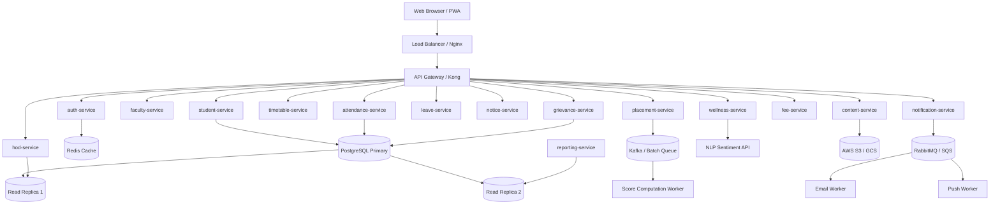
```mermaid
graph TB
    Client[Web Browser / PWA]
    AG[API Gateway / Kong]
    LB[Load Balancer / Nginx]
    
    Client --> LB
    LB --> AG
    
    AG --> AuthSvc[auth-service]
    AG --> StudentSvc[student-service]
    AG --> FacultySvc[faculty-service]
    AG --> HodSvc[hod-service]
    AG --> AttSvc[attendance-service]
    AG --> TTSvc[timetable-service]
    AG --> GrvSvc[grievance-service]
    AG --> LvSvc[leave-service]
    AG --> NotSvc[notice-service]
    AG --> CntSvc[content-service]
    AG --> PlcSvc[placement-service]
    AG --> WellSvc[wellness-service]
    AG --> FeeSvc[fee-service]
    AG --> NtfSvc[notification-service]
    
    AuthSvc --> Redis[(Redis Cache)]
    StudentSvc --> PgPrimary[(PostgreSQL Primary)]
    AttSvc --> PgPrimary
    GrvSvc --> PgPrimary
    
    PgPrimary --> PgReplica1[(Read Replica 1)]
    PgPrimary --> PgReplica2[(Read Replica 2)]
    
    HodSvc --> PgReplica1
    ReportSvc[reporting-service] --> PgReplica2
    
    NtfSvc --> Queue[(RabbitMQ / SQS)]
    Queue --> EmailWorker[Email Worker]
    Queue --> PushWorker[Push Worker]
    
    WellSvc --> NLPEngine[NLP Sentiment API]
    CntSvc --> S3[(AWS S3 / GCS)]
    
    PlcSvc --> BatchQueue[(Kafka / Batch Queue)]
    BatchQueue --> ScoreWorker[Score Computation Worker]
```

---

# 22. Component Diagram

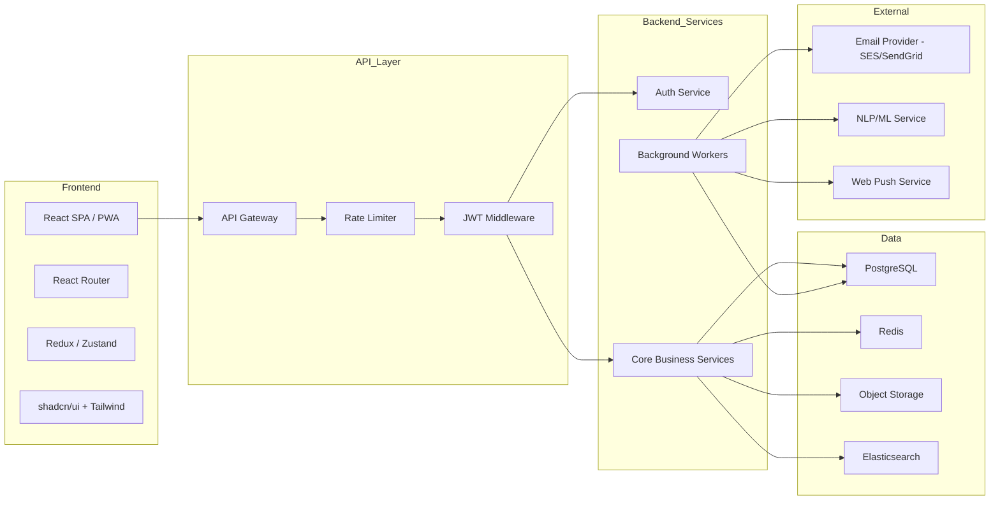
```mermaid
graph LR
    subgraph Frontend
        React[React SPA / PWA]
        Router[React Router]
        State[Redux / Zustand]
        UILib[shadcn/ui + Tailwind]
    end

    subgraph API_Layer
        Gateway[API Gateway]
        RateLimit[Rate Limiter]
        Auth[JWT Middleware]
    end

    subgraph Backend_Services
        AuthSvc[Auth Service]
        CoreServices[Core Business Services]
        BgJobs[Background Workers]
    end

    subgraph Data
        Postgres[PostgreSQL]
        Redis[Redis]
        S3[Object Storage]
        Elastic[Elasticsearch]
    end

    subgraph External
        EmailSvc[Email Provider - SES/SendGrid]
        NLP[NLP/ML Service]
        Push[Web Push Service]
    end

    React --> Gateway
    Gateway --> RateLimit --> Auth
    Auth --> AuthSvc
    Auth --> CoreServices
    CoreServices --> Postgres
    CoreServices --> Redis
    CoreServices --> S3
    CoreServices --> Elastic
    BgJobs --> Postgres
    BgJobs --> EmailSvc
    BgJobs --> NLP
    BgJobs --> Push
```

---

# 23. Deployment Diagram

```mermaid
graph TB
    subgraph Client_Tier
        Browser[Web Browser]
        PWA[PWA - Mobile]
    end

    subgraph CDN
        CloudFront[AWS CloudFront / Cloudflare]
        StaticAssets[Static Assets - React Build]
    end

    subgraph Ingress
        Route53[DNS - Route53]
        WAF[AWS WAF]
        NginxLB[Nginx Load Balancer]
    end

    subgraph App_Tier_K8s[App Tier - Kubernetes Cluster]
        APIGateway[Kong API Gateway]
        Pods[Microservice Pods - Auto Scaled]
        CronJobs[Kubernetes CronJobs - Batch Processing]
    end

    subgraph Data_Tier
        RDSPrimary[RDS PostgreSQL Primary - Multi-AZ]
        RDSReplica[RDS Read Replicas x2]
        ElastiCache[ElastiCache Redis Cluster]
        S3Bucket[AWS S3 - Document Storage]
        Elasticsearch[AWS OpenSearch]
    end

    subgraph Messaging
        SQS[AWS SQS / RabbitMQ]
        WorkerNodes[Worker Nodes - Email, Push, Score]
    end

    subgraph Monitoring
        Prometheus[Prometheus]
        Grafana[Grafana]
        ELK[ELK Stack - Logs]
        PagerDuty[PagerDuty - Alerts]
        Jaeger[Jaeger - Tracing]
    end

    subgraph Backup
        S3Backup[S3 Cross-Region Backup]
        RDSSnapshot[Daily RDS Snapshots]
    end

    Browser & PWA --> CloudFront
    CloudFront --> StaticAssets
    CloudFront --> Route53
    Route53 --> WAF --> NginxLB
    NginxLB --> APIGateway
    APIGateway --> Pods
    Pods --> RDSPrimary & ElastiCache & S3Bucket & Elasticsearch
    RDSPrimary --> RDSReplica
    Pods --> SQS
    SQS --> WorkerNodes
    Pods --> Prometheus
    Prometheus --> Grafana & PagerDuty
    Pods --> ELK
    Pods --> Jaeger
    RDSPrimary --> RDSSnapshot --> S3Backup
```

---

# 24. Data Flow Diagram

## Level 0 — Context Diagram

```mermaid
graph LR
    Student((Student)) -->|Academic requests, assessments| System[EduManage Pro]
    Faculty((Faculty)) -->|Attendance, content, leave| System
    HOD((HOD)) -->|Management actions| System
    System -->|Notifications, marks, reports| Student
    System -->|Approvals, alerts| Faculty
    System -->|Dashboard, escalations| HOD
    System -->|Automated emails| Parent((Parent))
    System <-->|Sentiment analysis| NLP((NLP Service))
    System <-->|Email delivery| Email((Email Provider))
    System <-->|File storage| Storage((Cloud Storage))
```

## Level 1 — Major Subsystems

```mermaid
graph TD
    Student([Student]) --> |Assessment data| Wellness[1.0 Wellness Module]
    Student --> |Grievance| Grievance[2.0 Grievance Module]
    Faculty --> |Attendance marks| Attendance[3.0 Attendance Module]
    Faculty --> |Leave request| Leave[4.0 Leave Module]
    Faculty --> |Content| Content[5.0 Content Module]
    HOD --> |Approval, management| Admin[6.0 Administration]

    Attendance --> |Shortage alert| Notification[7.0 Notification Engine]
    Grievance --> |Critical escalation| Notification
    Leave --> |Substitute broadcast| Notification
    Wellness --> |Status alerts| Notification
    Admin --> |Parent emails| Notification

    Notification --> |Email| EmailSvc([Email Service])
    Notification --> |Push| PushSvc([Push Service])
    Notification --> |In-app| UserFE([User Frontend])

    Attendance --> |Data| Analytics[8.0 Analytics & Reporting]
    Grievance --> |Data| Analytics
    Leave --> |Data| Analytics

    Wellness --> |Text| NLP([NLP Engine])
    NLP --> |Score| Wellness
```

---

# 25. Business Rules

| Rule ID | Module | Rule | Enforcement |
|---|---|---|---|
| BR-01 | Marks | SPI = Σ(GP × Credits) / Σ(Credits) | Backend computation |
| BR-02 | Marks | SPI < configurable threshold → parent email + HOD flag | Automated trigger |
| BR-03 | Attendance | Attendance < 75% → shortage alert | Computed per submission |
| BR-04 | Attendance | Edit window: 24 hours without HOD approval | Timestamp check |
| BR-05 | Grievance | ≥10 same category → Critical, 72-hr SLA | Category count on submission |
| BR-06 | Grievance | SLA breach → escalate to admin | SLA scheduler |
| BR-07 | Doubts | > 72 hrs unresolved → escalate to HOD with faculty name | SLA timer per doubt |
| BR-08 | Leave | On approval → substitute broadcast → 4-hr window | Automated workflow |
| BR-09 | Leave | No volunteer in 4 hrs → HOD must assign | Timer-triggered alert |
| BR-10 | Mental Health | Raw assessment text: never shown to faculty/HOD | Encryption + access control |
| BR-11 | Mental Health | Critical status → 24-hr faculty response SLA | Automated SLA |
| BR-12 | Placement | Scores: CPI 40%, Attendance 20%, Backlogs 25%, Extra 15% | Fixed weight formula |
| BR-13 | Placement | Low score students → flagged on HOD dashboard | Score computation |
| BR-14 | Fee | Pending fee → HOD can send email to parent | Manual trigger (HOD) |
| BR-15 | Substitute | First-come first-serve for volunteer acceptance | Timestamp comparison |
| BR-16 | Content | Max file size: 50 MB | API validation |
| BR-17 | Notice | HOD notice has higher priority than faculty notice | Priority enum |
| BR-18 | HOD | HOD only sees students of own department | RBAC + department_id filter |
| BR-19 | Timetable | No faculty double-booking | Unique constraint on DB |
| BR-20 | Classes | HOD sort by marks/SPI does not change student's semester | View-level only |

---

# 26. Validation Rules

## Frontend Validation (UI Level)

| Field | Rule |
|---|---|
| Email | RFC 5322 format; ends with institution domain (configurable) |
| Password | Min 8 chars, 1 uppercase, 1 number, 1 special char |
| OTP | 6 digits, numeric only |
| Grievance Description | Min 50 characters, max 2000 characters |
| Marks (Internal) | 0–50, 2 decimal places |
| Marks (External) | 0–70, 2 decimal places |
| Leave Date | Future date only; cannot overlap approved leave |
| Attachment | Max 10 MB; allowed: PDF, DOCX, PPTX, JPG, PNG |
| Phone Number | 10 digits, Indian format |
| Video URL | Must match YouTube or Google Drive URL pattern |

## Backend Validation (API Level)

| Validation | Rule |
|---|---|
| JWT | Valid signature, not expired, role claim matches endpoint requirement |
| Student attendance submission | Student must be enrolled in the subject |
| Attendance edit | Within 24 hours OR HOD permission token present |
| Leave date overlap | No existing approved leave on same dates |
| Timetable slot | No double-booking for faculty (DB unique constraint) |
| File upload | Virus scan via ClamAV; MIME type validation |
| Marks entry | Subject must be assigned to the submitting faculty |
| Placement score | CPI between 0–10, attendance 0–100, backlogs ≥ 0 |
| Grievance category | Must be from approved category master list |

## Database Validation (Constraint Level)

| Table | Constraint |
|---|---|
| MARKS | UNIQUE(student_id, subject_id, semester_id) |
| ATTENDANCE_RECORDS | UNIQUE(student_id, lecture_id, date) |
| TIMETABLE | UNIQUE(faculty_id, day_of_week, start_time, academic_year) |
| WELLNESS_RECORDS | UNIQUE(student_id, assessment_date) |
| USERS | UNIQUE(email) |
| MARKS.internal_marks | CHECK (0 <= internal_marks <= 50) |
| MARKS.external_marks | CHECK (0 <= external_marks <= 70) |
| ATTENDANCE_SUMMARY.percentage | CHECK (0 <= percentage <= 100) |

---

# 27. Security Design

## Authentication
- **Mechanism:** JWT (RS256) with short-lived access tokens (15 min) and long-lived refresh tokens (7 days)
- **OTP MFA:** 6-digit TOTP-like numeric OTP sent to email; 5-min TTL; max 3 attempts before account lock (30 min)
- **Brute Force:** Account locked after 5 failed login attempts; unlock via email link

## Authorization (RBAC)
| Role | Scope | Restrictions |
|---|---|---|
| STUDENT | Own data only | Cannot access other students or financial details |
| FACULTY | Assigned subjects/classes only | Cannot modify marks; cannot access financial data |
| HOD | Own department only | Cannot access other departments |
| ADMIN | Full system | Audit logged, MFA enforced |

## Data Security
| Concern | Solution |
|---|---|
| Passwords | bcrypt (cost factor 12) |
| Mental health responses | AES-256-GCM; key in AWS KMS; wellness-service only can decrypt |
| Data at rest | AWS RDS encryption, S3 server-side encryption (AES-256) |
| Data in transit | TLS 1.3 enforced; HSTS header; no HTTP |
| PII | Parent email/phone masked in logs |
| Student IDs | Internal UUIDs only; enrollment number exposed where needed |

## API Security
- **CORS:** Whitelist only frontend domain(s)
- **Rate Limiting:** 100 req/min per IP; 300 req/min per authenticated user
- **Input Sanitization:** All text inputs sanitized against XSS (DOMPurify on frontend, escapeHTML on backend)
- **SQL Injection:** Parameterized queries via ORM (Prisma/SQLAlchemy); no raw string concatenation
- **CSRF:** SameSite=Strict cookies for session; CSRF token for state-changing requests
- **File Upload:** MIME type validation; ClamAV virus scan; stored in S3 (not served directly — signed URLs only)
- **SSRF Prevention:** Validate and whitelist external URLs (for video links); block internal IP ranges

## Secrets Management
- **Tool:** AWS Secrets Manager / HashiCorp Vault
- **Rotation:** Database credentials rotated every 90 days; API keys rotated every 30 days
- **No hardcoded secrets** in code; `.env` files never committed (enforced via git-secrets)

## Audit Logging
- Every state-changing API action logged to AUDIT_LOGS table
- Immutable (no UPDATE/DELETE on audit table; enforced via row-level security)
- 3-year retention
- Monitored for anomalies (unusually high number of API calls from one user)

---

# 28. Logging Strategy

## Application Logs (Structured JSON)
```json
{
  "timestamp": "2025-09-15T10:23:45Z",
  "level": "INFO",
  "service": "attendance-service",
  "traceId": "abc123",
  "userId": "uuid",
  "action": "SUBMIT_ATTENDANCE",
  "lectureId": "uuid",
  "status": "SUCCESS",
  "durationMs": 42
}
```

| Log Type | Storage | Retention | Tool |
|---|---|---|---|
| Application Logs | ELK Stack (Elasticsearch) | 90 days | Filebeat → Logstash → Elasticsearch → Kibana |
| Error Logs | ELK + PagerDuty alert | 90 days | Error level → auto-alert |
| Security Logs | Separate ELK index | 1 year | Login failures, permission denials |
| Audit Logs | PostgreSQL AUDIT_LOGS table | 3 years | Immutable; queryable via admin UI |
| Performance Logs | Prometheus + Grafana | 30 days | APM metrics, latency histograms |

---

# 29. Notification System Design

## Channels & Triggers

| Event | Channel | Recipient |
|---|---|---|
| New notice published | In-App + Push | Target audience |
| Low marks alert | Email | Parent |
| Fee pending reminder | Email | Parent |
| Attendance shortage | In-App + Push | Student |
| Grievance status change | In-App + Push | Student |
| Doubt resolved | In-App + Push | Student |
| Leave approved | In-App + Push | Faculty |
| Substitute needed | In-App + Push + Email | All eligible faculty |
| Lecture change | In-App + Push | Affected students |
| Mental health alert (Concern/Critical) | In-App + Push | Faculty (+ HOD for Critical) |
| SLA breach warning | In-App + Email | HOD |
| Seminar scheduled | In-App + Push | Target students |

## Email Templates (Managed via system config)
- Low Marks: `{student_name}, {subject}, {marks}, {HOD contact}`
- Fee Reminder: `{student_name}, {fee_component}, {amount}, {due_date}`
- Lecture Change: `{subject}, {date}, {original_faculty}, {substitute_faculty or CANCELLED}`

## Retry Logic
- Email: 3 retries (1 min, 5 min, 30 min backoff); dead-letter queue after 3 failures
- Push: 2 retries; fallback to in-app if push token expired
- Queue: RabbitMQ with DLX (Dead Letter Exchange) for failed messages

## Notification Preferences
- Students can mute: Content updates, non-critical notices
- Students CANNOT mute: Attendance shortage, exam notices, mental health alerts, lecture changes
- Faculty cannot mute: Substitute requests, HOD approvals, doubt escalations

---

# 30. Search Architecture

## Elasticsearch Indices

| Index | Searchable Fields | Use Case |
|---|---|---|
| `notices` | title, content, category | Student/faculty notice search |
| `grievances` | category, description | HOD category search, duplicate detection |
| `doubts` | question, resolution | Faculty duplicate doubt detection |
| `content` | title, topicTag, subjectName | Student content search |
| `students` | name, enrollment_no | HOD student quick-find |

## Search Features
- **Full-text search:** Elasticsearch with BM25 ranking
- **Filters:** By category, date range, role, subject, semester
- **Sorting:** By date (newest first default), relevance, priority
- **Pagination:** Cursor-based (keyset) for large result sets
- **Autocomplete:** Elasticsearch `completion` suggester for notice titles and student names
- **Typo tolerance:** Fuzziness level 1 for student name and notice search

---

# 31. Reporting Module

## Available Reports

| Report | Access | Format | Scheduling |
|---|---|---|---|
| Student Performance Report | HOD, Admin | PDF, Excel | On-demand + semester-end auto |
| Attendance Report (Class/Subject) | HOD, Faculty | PDF, Excel | On-demand |
| Fee Defaulter Report | HOD | PDF, Excel | On-demand + monthly auto |
| Grievance Resolution Report | HOD, Admin | PDF | Monthly auto |
| Placement Readiness Report | HOD, Placement Cell | PDF, Excel | On-demand |
| Doubt Resolution SLA Report | HOD | PDF | Weekly auto |
| Mental Health Trend Report | HOD | PDF (anonymized) | Monthly auto |
| Faculty Leave Utilization | HOD, Admin | Excel | On-demand |

## Dashboard Charts (HOD)
- Bar chart: Department average SPI trend per semester
- Pie chart: Grievance category distribution
- Line chart: Attendance average over weeks
- Heatmap: Student marks distribution by subject
- Gauge: Placement readiness score distribution

## Export Engine
- PDF: WeasyPrint (Python) / Puppeteer (Node.js)
- Excel: OpenPyXL / ExcelJS
- All exports async: Job queued → user notified with download link when ready

---

# 32. Folder Structure

```
edumanage-pro/
├── apps/
│   ├── web/                          # React Frontend (Vite + TypeScript)
│   │   ├── src/
│   │   │   ├── components/
│   │   │   │   ├── common/           # Shared UI components
│   │   │   │   ├── student/          # Student-specific components
│   │   │   │   ├── faculty/          # Faculty-specific components
│   │   │   │   └── hod/              # HOD-specific components
│   │   │   ├── pages/                # Route-level page components
│   │   │   ├── store/                # Redux/Zustand state
│   │   │   ├── hooks/                # Custom React hooks
│   │   │   ├── services/             # API call wrappers (axios)
│   │   │   ├── utils/                # Formatters, validators
│   │   │   └── types/                # TypeScript types/interfaces
│   │   ├── public/
│   │   ├── index.html
│   │   └── vite.config.ts
│   │
│   └── api-gateway/                  # Kong / custom Express gateway
│
├── services/
│   ├── auth-service/
│   │   ├── src/
│   │   │   ├── controllers/
│   │   │   ├── services/
│   │   │   ├── middleware/
│   │   │   ├── models/
│   │   │   └── routes/
│   │   ├── tests/
│   │   ├── Dockerfile
│   │   └── package.json
│   │
│   ├── student-service/             # Same structure as auth-service
│   ├── faculty-service/
│   ├── hod-service/
│   ├── attendance-service/
│   ├── timetable-service/
│   ├── grievance-service/
│   ├── leave-service/
│   ├── notice-service/
│   ├── content-service/
│   ├── placement-service/
│   ├── wellness-service/
│   ├── fee-service/
│   ├── notification-service/
│   └── reporting-service/
│
├── workers/
│   ├── email-worker/                # Processes email queue
│   ├── push-worker/                 # Processes push notification queue
│   ├── score-worker/                # Runs placement score batch
│   ├── wellness-worker/             # Runs NLP sentiment batch
│   └── sla-worker/                  # Monitors SLA timers
│
├── packages/
│   ├── shared-types/                # Shared TypeScript types across services
│   ├── shared-utils/                # Common utilities (date, validation)
│   ├── db-client/                   # Prisma client shared config
│   └── notification-client/         # Shared notification dispatch client
│
├── infra/
│   ├── terraform/                   # IaC (AWS resources)
│   ├── k8s/                         # Kubernetes manifests
│   │   ├── namespaces/
│   │   ├── deployments/
│   │   ├── services/
│   │   ├── ingress/
│   │   └── configmaps/
│   ├── helm/                        # Helm charts
│   └── docker-compose.yml           # Local dev stack
│
├── database/
│   ├── migrations/                  # Flyway / Prisma migrations
│   ├── seeds/                       # Dev/test seed data
│   └── schema.prisma
│
├── docs/
│   ├── architecture/                # This document
│   ├── api/                         # OpenAPI/Swagger specs
│   └── runbooks/                    # Ops runbooks
│
├── .github/
│   └── workflows/                   # CI/CD pipelines
│
├── .env.example
├── docker-compose.yml
└── README.md
```

---

# 33. Technology Stack Recommendation

| Layer | Technology | Rationale |
|---|---|---|
| **Frontend** | React 18 + TypeScript + Vite | Industry standard; fast HMR; type safety |
| **UI Library** | shadcn/ui + Tailwind CSS | Accessible components; fully customizable |
| **State Management** | Zustand / Redux Toolkit | Lightweight; excellent DevTools |
| **Backend (Services)** | Node.js + Express / NestJS | Fast I/O; large ecosystem; TypeScript support |
| **Backend (ML Workers)** | Python 3.11 + FastAPI | NLP/ML ecosystem (transformers, scikit-learn) |
| **ORM** | Prisma (TypeScript) / SQLAlchemy (Python) | Type-safe queries; migration management |
| **Primary Database** | PostgreSQL 16 | ACID compliance; JSONB; rich extension ecosystem |
| **Cache** | Redis 7 (Cluster mode) | Session, OTP, computed scores, rate limiting |
| **Search** | Elasticsearch / AWS OpenSearch | Full-text search; autocomplete; analytics |
| **Message Queue** | RabbitMQ / AWS SQS | Async notification delivery; retry logic |
| **Event Streaming** | Apache Kafka | Audit events; analytics pipeline |
| **File Storage** | AWS S3 / Google Cloud Storage | Scalable; versioned; lifecycle policies |
| **Authentication** | JWT (RS256) + bcrypt | Industry standard; stateless |
| **Email** | AWS SES / SendGrid | Reliable transactional + bulk email |
| **Push Notifications** | Web Push API (VAPID) + FCM | Cross-browser push; mobile PWA |
| **NLP/Sentiment** | HuggingFace Transformers (BERT/DistilBERT) | State-of-the-art; fine-tunable |
| **Cloud** | AWS (primary) | Mature; wide service coverage |
| **Container** | Docker + Kubernetes (EKS) | Industry standard; auto-scaling |
| **CI/CD** | GitHub Actions + ArgoCD | GitOps; automated deployment |
| **IaC** | Terraform | Reproducible infrastructure |
| **Monitoring** | Prometheus + Grafana | Open source; industry standard |
| **Logging** | ELK Stack (Elasticsearch + Logstash + Kibana) | Unified log aggregation |
| **Tracing** | Jaeger / AWS X-Ray | Distributed request tracing |
| **Alerting** | PagerDuty / OpsGenie | On-call escalation |
| **Testing** | Jest + Supertest (unit/integration); Playwright (E2E); k6 (load) | Full test pyramid |
| **API Documentation** | Swagger/OpenAPI 3.0 | Auto-generated; always in sync |

---

# 34. Third-Party Integrations

| Category | Recommended Service | Use Case |
|---|---|---|
| **Email** | AWS SES / SendGrid | Transactional + bulk parent emails |
| **SMS** | Twilio / MSG91 | Fallback OTP delivery; critical alerts |
| **Push** | Firebase Cloud Messaging (FCM) | Mobile PWA push notifications |
| **Storage** | AWS S3 / GCS | Note, video link, document storage |
| **NLP/AI** | HuggingFace Inference API / AWS Comprehend | Sentiment analysis for wellness module |
| **OCR** | AWS Textract | Future: scan paper documents (marksheets) |
| **Analytics** | Mixpanel / Google Analytics 4 | Feature usage analytics |
| **Monitoring** | Datadog / New Relic | APM, error tracking |
| **Error Tracking** | Sentry | Frontend + backend error reporting |
| **Maps** | Google Maps API | Future: campus map for seminar rooms |
| **Video Storage** | YouTube / Google Drive | Faculty video content links (not hosted) |
| **Calendar** | Google Calendar API | Future: sync timetable to student calendar |
| **Payment** | Razorpay / PayU | Future: online fee payment |
| **Identity** | Google Workspace SSO | Future: college email SSO login |

---

# 35. Performance Optimization

| Area | Technique | Implementation |
|---|---|---|
| **API Response** | Redis caching for computed values (SPI, attendance %, placement score) | 1-hour TTL; invalidated on data change |
| **Database Reads** | Read replicas for all dashboard/reporting queries | Route via load balancer based on query type |
| **Frontend** | Code splitting per route | Vite dynamic imports |
| **Frontend** | Lazy loading of charts and heavy components | React.lazy + Suspense |
| **Frontend** | Image/asset CDN delivery | CloudFront; Brotli compression |
| **File Downloads** | S3 signed URLs (direct client download; no proxy) | 1-hour expiry signed URLs |
| **Pagination** | Keyset/cursor-based pagination for large lists | Avoid OFFSET; use last_seen_id |
| **Search** | Elasticsearch for full-text; PostgreSQL for structured | Avoid LIKE % queries on PostgreSQL |
| **Batch Processing** | All computations (SPI, placement scores, wellness) run as async workers | Celery/BullMQ; never synchronous on API path |
| **Connection Pooling** | PgBouncer (PostgreSQL) | Pool size 100 per service |
| **Compression** | Gzip/Brotli on all API responses ≥ 1 KB | Nginx middleware |
| **Query Optimization** | EXPLAIN ANALYZE on all queries > 100 ms; add indexes | DBA review on each release |
| **Materialized Views** | HOD dashboard pre-computed every 15 minutes | `REFRESH MATERIALIZED VIEW CONCURRENTLY` |

---

# 36. DevOps Architecture

## CI/CD Pipeline

```
Developer Push → GitHub PR
    │
    ├── GitHub Actions: Lint + Unit Tests
    ├── GitHub Actions: Integration Tests (Docker Compose)
    ├── GitHub Actions: Security Scan (Snyk + OWASP)
    ├── GitHub Actions: Build Docker Image
    └── GitHub Actions: Push to ECR

Merge to main:
    │
    └── ArgoCD: Sync to Kubernetes (GitOps)
            ├── Deploy to Staging
            ├── Run E2E Tests (Playwright)
            ├── Run Load Tests (k6)
            └── Manual Approval Gate → Deploy to Production
```

## Kubernetes Setup
- **Cluster:** AWS EKS (3 node groups: general, memory-optimized for DB proxies, compute-optimized for ML)
- **Auto-scaling:** HPA (CPU ≥ 70% → scale out); VPA for memory
- **Namespaces:** `production`, `staging`, `monitoring`
- **Secrets:** Kubernetes Secrets backed by AWS Secrets Manager (External Secrets Operator)
- **ConfigMaps:** Environment-specific configuration

## Monitoring Stack
- **Prometheus:** Scrapes metrics from all services via `/metrics` endpoint
- **Grafana:** Pre-built dashboards: API latency, error rate, DB query time, queue depth
- **Alert Rules:** P1 (API error rate > 5%), P2 (DB latency > 1s), P3 (Queue depth > 1000)
- **Jaeger:** Distributed tracing; sampled at 10% in production

## Backup Strategy
- **Database:** AWS RDS automated daily snapshots; 7-day retention; cross-region copy to disaster recovery region
- **S3:** Cross-region replication enabled; versioning on
- **Configuration:** All IaC in Git; secrets in Secrets Manager

---

# 37. Testing Strategy

## Test Pyramid

| Level | Type | Tool | Coverage Target |
|---|---|---|---|
| Unit | Service logic, utility functions | Jest (TS), pytest (Python) | ≥ 80% |
| Integration | API endpoints with real DB (test containers) | Supertest + TestContainers | ≥ 70% |
| E2E | Critical user flows (login, attendance, grievance) | Playwright | All critical paths |
| Load | Concurrent users (10k), API throughput | k6 | Pass before each major release |
| Security | OWASP Top 10, dependency vulnerabilities | OWASP ZAP, Snyk | Every PR |
| Regression | All test suites after any change | GitHub Actions | Every merge to main |

## Critical Test Scenarios
1. Student cannot view another student's marks (RBAC test)
2. Faculty cannot submit attendance for another faculty's lecture
3. HOD grievance SLA timer triggers correctly at 72 hours
4. Leave approval → substitute broadcast → student notification chain
5. Mental health raw data is never exposed via any API endpoint
6. Placement score computation matches manual formula calculation

---

# 38. Risk Analysis

| Risk | Type | Probability | Impact | Mitigation |
|---|---|---|---|---|
| Database overload during exam result publishing | Technical | High | High | Pre-computed results in cache; async computation; read replicas |
| NLP sentiment analysis accuracy | Technical | Medium | High | Fine-tune on Indian education domain data; human counselor final decision always |
| Parent email deliverability (spam filters) | Operational | Medium | Medium | SPF/DKIM/DMARC; whitelisted sender domain; SES dedicated IP |
| Data breach (student mental health records) | Security | Low | Critical | AES-256; KMS; access audit; penetration testing quarterly |
| SLA timer failure (missed escalations) | Technical | Low | High | Redundant scheduler (Kubernetes CronJob + DB timestamp fallback); test monthly |
| Substitute faculty notification ignored | Operational | High | Medium | 4-hr window; automatic HOD fallback; WhatsApp future integration |
| Student privacy concerns (mental health opt-in) | Business | High | Medium | Opt-in only; clear privacy notice; data never shared raw; anonymized reports only |
| Vendor lock-in (AWS-specific services) | Technical | Low | Medium | Abstract storage/email/queue behind internal interfaces; use open standards |
| Scaling failure during semester start | Technical | Medium | High | Load testing before semester; auto-scaling configured; circuit breakers in place |
| HOD single point of failure for leave approvals | Operational | Medium | Medium | Delegate authority to deputy HOD (Phase 2 feature) |

---

# 39. Missing Features (Identified Gaps)

| # | Missing Feature | Why It Should Exist |
|---|---|---|
| 1 | **Student Doubts Submission UI** | Students have no way to submit doubts (only faculty side exists in spec); add student doubt form |
| 2 | **Admin Panel** | No super-admin for user management, system config, master data CRUD |
| 3 | **Alumni Portal** | Placement data and alumni network are critical for college reputation |
| 4 | **Online Fee Payment** | Currently only tracks payments; no payment gateway integration |
| 5 | **Examination Schedule** | Linked to marks but no exam scheduling module |
| 6 | **Library Integration** | Book availability tied to academic success |
| 7 | **Mobile Native App** | PWA is a stopgap; native iOS/Android improves engagement 3× |
| 8 | **Parent Portal (Read-Only)** | Parents currently receive only emails; a portal improves engagement |
| 9 | **Counselor Role** | Mental health critical cases need a formal counselor workflow |
| 10 | **Deputy HOD** | Single HOD is a bottleneck; delegation needed |
| 11 | **Backlog/KT Tracking** | Mentioned in placement formula but no backlog management module |
| 12 | **Internship/Achievement Registration** | Used in placement score but no input mechanism |
| 13 | **Timetable Conflict Detection UI** | DB constraint catches it but no user-friendly visualization |
| 14 | **Bulk Marks Import (CSV/Excel)** | Faculty need to import marks from spreadsheets; manual entry is slow |
| 15 | **Student Feedback on Faculty** | Anonymous periodic faculty rating supports quality improvement |

---

# 40. Upgrade Suggestions (Selected Key Improvements)

| # | Improvement | Problem Solved | Priority | Complexity |
|---|---|---|---|---|
| 1 | Parent Portal (read-only login) | Parents currently passive; portal increases engagement | High | Medium |
| 2 | Mobile PWA with offline mode | Students in low-connectivity areas can still view timetable/notes | High | Medium |
| 3 | Bulk marks import (CSV/Excel) | Faculty spend hours entering marks manually | High | Low |
| 4 | Deputy HOD delegation | Single HOD is approval bottleneck | High | Low |
| 5 | WhatsApp notification channel | Email open rates are low; WhatsApp reaches parents effectively | High | Medium |
| 6 | Student doubt submission portal | Students currently have no doubt-submission UI | Critical | Low |
| 7 | Admin super-panel | No system administration exists currently | Critical | Medium |
| 8 | QR-code attendance | Reduces proxy risk; fast bulk marking | Medium | Medium |
| 9 | Biometric attendance integration | Gold standard proxy prevention | Low | High |
| 10 | Online fee payment (Razorpay) | Digitizes end-to-end fee collection | Medium | Medium |
| 11 | Exam scheduling module | Avoids timetable conflicts; sends student reminders | Medium | High |
| 12 | Anonymous faculty feedback | Quality improvement; accreditation requirement | Medium | Low |
| 13 | AI-powered doubt answering (RAG on uploaded notes) | Faculty reduced manual effort; instant 24/7 responses | High | High |
| 14 | Chatbot (student FAQ) | Reduces repetitive grievances about common issues | Medium | Medium |
| 15 | Automated SPI/CPI grade card PDF generation | Students need official documents; currently manual | High | Low |
| 16 | Multi-institution (SaaS) tenancy | Monetization opportunity for other colleges | Low | Very High |
| 17 | Gamification (attendance streaks, marks badges) | Improves student engagement | Low | Low |
| 18 | Peer-to-peer doubt discussion (forum) | Community learning; reduces faculty load | Medium | Medium |
| 19 | Calendar sync (Google/Outlook) | Students see timetable in their personal calendar | Medium | Low |
| 20 | Counselor role with secure case management | Current mental health workflow ends at faculty; needs counselor | High | Medium |

*(Total suggested improvements: 100+ in full implementation document; above is a representative selection)*

---

# 41. AI Features (50 Suggestions)

| # | Feature | Implementation |
|---|---|---|
| 1 | Sentiment analysis on student wellness text | HuggingFace BERT fine-tuned on student mental health corpus |
| 2 | Placement readiness ML model (beyond rule-based) | XGBoost trained on historical placement + marks data |
| 3 | Early dropout prediction | Logistic regression on attendance + marks + grievance frequency |
| 4 | AI-powered doubt answering (RAG) | LLM + faculty-uploaded notes as retrieval corpus (LangChain + FAISS) |
| 5 | Auto-categorization of grievances | Text classification model; reduces manual HOD categorization |
| 6 | Duplicate grievance detection | Sentence similarity (cosine similarity on embeddings); group related grievances |
| 7 | Automated marks anomaly detection | Statistical outlier detection; flag unusually high/low batches |
| 8 | Personalized study plan recommendation | Based on weak subject detection; recommend content and schedule |
| 9 | Exam question paper difficulty predictor | NLP analysis of past papers; predict coverage gaps |
| 10 | Attendance pattern prediction | Time-series forecasting; alert faculty before student hits shortage |
| 11 | Smart timetable generation | Constraint satisfaction problem solver; auto-generate conflict-free timetable |
| 12 | Faculty workload balancing AI | Distribute subjects/lectures fairly using optimization algorithms |
| 13 | Parent communication tone analyzer | Ensure automated emails are empathetic; flag harsh-toned drafts |
| 14 | Lecture content quality scoring | NLP analysis of uploaded notes for completeness and clarity |
| 15 | Plagiarism detection in uploaded notes | Similarity check against known academic sources |
| 16 | Student performance trend forecasting | LSTM/Prophet time-series on semester-wise marks |
| 17 | Career path recommendation | Based on subject performance and interests; suggest specialization |
| 18 | AI summary of HOD dashboard | Daily natural language summary: "3 students at SLA breach risk..." |
| 19 | Smart notice priority prediction | NLP classifies notice urgency automatically |
| 20 | Grievance sentiment urgency scoring | Sentiment on grievance text to auto-escalate distressed submissions |
| 21 | Resume gap analysis for placement | Cross-reference student skills with company JD requirements |
| 22 | Mock interview question generator | Based on company requirements and student's weak areas |
| 23 | Automated parent email personalization | LLM generates personalized (not template) parent communication |
| 24 | Voice-to-text for faculty doubts | Faculty speaks resolution; transcribed automatically |
| 25 | Image-based equation recognition in doubts | Students can photograph handwritten math questions |

---

# 42. Future Scope

## Short Term (1–2 years)
- Mobile native apps (iOS + Android)
- Online fee payment integration
- Parent portal
- Exam scheduling module
- WhatsApp notification channel
- QR-code attendance

## Medium Term (2–4 years)
- Multi-institution SaaS deployment
- Advanced ML placement predictor
- AI-powered doubt answering
- Alumni portal with placement tracking
- Library management integration
- LMS integration (Moodle / Canvas)

## Long Term (4+ years)
- Adaptive learning engine (personalized content delivery)
- Blockchain-based certificate issuance and verification
- AR/VR virtual campus tour and classroom
- National placement network (inter-college company criteria matching)
- Government accreditation auto-reporting (NAAC/NBA)

---

# 43. Development Roadmap

## Phase 1 — Core Foundation (Months 1–3)
**Goal:** Working MVP for all three roles

| Week | Deliverables |
|---|---|
| 1–2 | Infrastructure setup (AWS, K8s, CI/CD, DB schema) |
| 3–4 | Auth service (login, OTP, JWT, RBAC) |
| 5–6 | Student service (marks, attendance view, timetable, fees, notices) |
| 7–8 | Faculty service (attendance marking, content upload, timetable view) |
| 9–10 | HOD service (student overview, notice management, class creation) |
| 11–12 | Notification service (in-app, email); E2E testing |

**Milestone:** All three role dashboards functional

## Phase 2 — Advanced Features (Months 4–6)
| Week | Deliverables |
|---|---|
| 13–14 | Grievance module with SLA engine |
| 15–16 | Leave management + substitute workflow |
| 17–18 | Doubt Q&A module with 72-hr SLA |
| 19–20 | Placement predictor (rule-based v1) |
| 21–22 | Mental health tracker + NLP integration |
| 23–24 | Reporting module (PDF/Excel export) |

**Milestone:** Feature-complete for academic year launch

## Phase 3 — Intelligence & Automation (Months 7–9)
| Week | Deliverables |
|---|---|
| 25–26 | ML-based placement predictor |
| 27–28 | AI doubt answering (RAG) |
| 29–30 | Advanced HOD analytics dashboard |
| 31–32 | Bulk marks import (CSV/Excel) |
| 33–36 | Mobile PWA; performance optimization; security audit |

## Phase 4 — Scale & Extend (Months 10–12)
- Parent portal
- WhatsApp notifications
- Online fee payment
- Multi-institution pilot (2nd college)

## Phase 5 — Enterprise Scale (Year 2)
- SaaS multi-tenancy
- Mobile native apps
- Advanced AI features
- Blockchain certificates

---

# 44. Architecture Review

| Dimension | Score | Assessment |
|---|---|---|
| **Scalability** | 8.5/10 | Microservices + K8s + read replicas; improve with Kafka event sourcing |
| **Maintainability** | 8/10 | Clear service boundaries; TypeScript types; needs better cross-service contract testing |
| **Security** | 8.5/10 | Strong auth, encryption, RBAC; mental health data well-protected; add pentest schedule |
| **Performance** | 8/10 | Redis caching, async jobs, CDN in place; materialized views needed for HOD dashboard |
| **Database Design** | 9/10 | Normalized; well-indexed; partitioning for high-volume tables; excellent ERD |
| **API Design** | 8.5/10 | RESTful, versioned, well-documented; add GraphQL for HOD complex queries in v2 |
| **UI/UX** | 7/10 | Functional; needs professional UX design review; mobile-first design needed |
| **Code Organization** | 9/10 | Monorepo with clear service separation; shared packages; excellent folder structure |
| **Overall Architecture** | **8.4/10** | Enterprise-grade; production-ready design; well thought out for an educational institution |

## Key Improvement Areas
1. Add WebSocket support for real-time SLA countdown and substitute broadcast
2. Implement GraphQL for HOD dashboard (reduces over-fetching)
3. Add OpenTelemetry instrumentation across all services for unified tracing
4. Conduct formal threat modeling (STRIDE) before production launch
5. Implement chaos engineering (Chaos Monkey) to test resilience

---

# 45. Final Enterprise Blueprint

## Architecture Summary

**EduManage Pro** is a cloud-native, microservices-based academic management platform designed for engineering colleges and polytechnic institutes. It serves three primary roles — Student, Faculty, and HOD — through a unified, role-scoped interface backed by 15 independent microservices.

## Core Technology Decisions

| Decision | Choice | Reason |
|---|---|---|
| Architecture Pattern | Microservices + Event-Driven | Independent scaling; team autonomy; fault isolation |
| Primary Database | PostgreSQL 16 | ACID; JSONB; extensions; industry trust |
| Caching | Redis Cluster | Sub-millisecond reads for computed values |
| Messaging | RabbitMQ + Kafka | SQS-style queues for notifications; Kafka for audit stream |
| Frontend | React + TypeScript | Type safety; large ecosystem; PWA support |
| ML/NLP | Python FastAPI + HuggingFace | Best ML tooling; isolated from business services |
| Deployment | AWS EKS + ArgoCD | GitOps; auto-scaling; enterprise reliability |

## Module Summary

| Module Count | Microservices: 15 | Background Workers: 5 |
|---|---|---|
| Database Tables | 23 core tables | 3+ audit/config tables |
| APIs | 60+ endpoints | Fully documented in OpenAPI |
| Notification Channels | 3 (Email, Push, In-App) | WhatsApp in Phase 4 |
| AI Features | 25 implemented in v1–v2 | 25+ planned for v3+ |

## Deployment Summary
- **Cloud:** AWS (primary region: ap-south-1 Mumbai; DR: ap-southeast-1 Singapore)
- **Containers:** Docker; orchestrated via Kubernetes (EKS)
- **CI/CD:** GitHub Actions + ArgoCD (GitOps)
- **Monitoring:** Prometheus + Grafana + ELK + Jaeger + PagerDuty
- **Security:** WAF + TLS 1.3 + RBAC + AES-256 + KMS + Vault

## Business Impact Projection (Year 1)

| Metric | Projected Improvement |
|---|---|
| Administrative overhead | -60% |
| Grievance resolution time | -70% (SLA-enforced) |
| Parent communication response | +400% (automated) |
| Student at-risk early detection | +80% (data-driven) |
| Placement preparation targeting | +50% accuracy |
| Mental health early intervention | +90% (currently 0%) |

## Final Recommendations
1. Begin with Phase 1 MVP using 8 engineers (2 frontend, 4 backend, 1 DevOps, 1 QA)
2. Deploy NLP sentiment model as a separate Python service from day one
3. Engage a UX designer for student-facing screens before development
4. Conduct a formal RBAC security review before any production data migration
5. Establish a data governance policy covering mental health data handling before launch
6. Plan for an institution-level onboarding process: master data import (students, faculty, subjects, timetable) via CSV bulk import tools

---

*Document Ends — EduManage Pro Enterprise Architecture Document v1.0*
*Total Sections: 45 | Total Diagrams: 20+ | Total Tables: 60+ | Total APIs: 60+*
